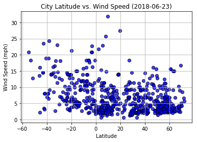

# WeatherPy - Lucas Liang


```python
#dependencies

import numpy as np
import matplotlib.pyplot as plt
import openweathermapy as owm
import pandas as pd
import json


from datetime import date
from random import randint
from citipy import citipy
```


```python
#create ramdon latitude through 6 set of latitude
#this is to cover the full range of latitude by every 30 degrees from north pole to south pole

x_latitude_1 = [randint(-90, -60) for p in range(0, 400)]
x_latitude_2 = [randint(-60, -30) for p in range(0, 400)]
x_latitude_3 = [randint(-30, 0) for p in range(0, 400)]
x_latitude_4 = [randint(0, 30) for p in range(0, 400)]
x_latitude_5 = [randint(30, 60) for p in range(0, 400)]
x_latitude_6 = [randint(60, 90) for p in range(0, 400)]

x_latitude = x_latitude_1 + x_latitude_2 + x_latitude_3 + x_latitude_4+ x_latitude_5+ x_latitude_6

#print(str(len(x_latitude)))
#print(x_latitude)
```


```python
#create ramdon longtitude through 6 set of longtitude
#this is to cover the full range of longtitude by every 60 degrees from west to east

x_longtitude_1 = [randint(-180, -120) for p in range(0, 400)]
x_longtitude_2 = [randint(-120, -60) for p in range(0, 400)]
x_longtitude_3 = [randint(-60, 0) for p in range(0, 400)]
x_longtitude_4 = [randint(0, 60) for p in range(0, 400)]
x_longtitude_5 = [randint(60, 120) for p in range(0, 400)]
x_longtitude_6 = [randint(120, 180) for p in range(0, 400)]

x_longtitude = x_longtitude_1 + x_longtitude_2 + x_longtitude_3 + x_longtitude_4 + x_longtitude_5 + x_longtitude_6

#print(str(len(x_longtitude)))
#print(x_longtitude)
```


```python
#get city based on random x_latitude and x_longtitude

#create a empty list to store city coordinate
city_list = []    

#store city coordinate via loop
for x_lat, x_lon in zip(x_latitude,x_longtitude):
    city_list.append(citipy.nearest_city(x_lat, x_lon))

#store city name via loop
city_name_list = []
for city in city_list:
    city_name_list.append(city.city_name)
    
#store unique city name
unique_city_name_list = list(set(city_name_list))

#check for number of unique city
#print(str(len(unique_city_name_list)))

#check for city name
#print(unique_city_name_list)
```


```python
#test weather set
#api = 'ada32f6f2c68d7b9107ab5982777180d'
#settings={'units':'imperial', 'appid':api}

#test_city_weather = owm.get_current(city = 'codrington', **settings)

#test_city_weather

#print(unique_city_name_list[0])
```


```python
#create variable/list and api key

api = 'ada32f6f2c68d7b9107ab5982777180d'
settings={'units':'imperial', 'appid':api}

city_clouds = []
city_lat = []
city_lng = []
city_hum = []
city_wind = []
city_temp_max = []
city_date = []
city_country = []
city_name = []
city_id = []
```


```python
#set counter to zero
counter = 0

print('Beginning Data Retrieval')
print('------------------------')

for city in unique_city_name_list:
        
    try:
        #query weather data via api
        city_weather = owm.get_current(city = city, **settings)
        
        #print header and url per city
        counter += 1
        print('Processing Record ' + str(counter) + ' | ' + city)
        print(owm.BASE_URL + "appid=" + api + "&q=" + city)
        
        #append data into each variable/list per city
        city_clouds.append(city_weather('clouds.all'))
        city_lat.append(city_weather('coord.lat'))
        city_lng.append(city_weather('coord.lon'))
        city_hum.append(city_weather('main.humidity'))
        city_wind.append(city_weather('wind.speed'))
        city_temp_max.append(city_weather('main.temp_max'))
        city_date.append(city_weather('dt'))
        city_country.append(city_weather('sys.country'))
        city_name.append(city_weather('name'))
        city_id.append(city_weather('id'))
        
    except:
        pass
    #if counter == 500:
     #   break

print('------------------------')
print('Data Retrieval Complete')
print('------------------------')
```

    Beginning Data Retrieval
    ------------------------
    Processing Record 1 | camaragibe
    http://api.openweathermap.org/data/2.5/appid=ada32f6f2c68d7b9107ab5982777180d&q=camaragibe
    Processing Record 2 | yumen
    http://api.openweathermap.org/data/2.5/appid=ada32f6f2c68d7b9107ab5982777180d&q=yumen
    Processing Record 3 | buraydah
    http://api.openweathermap.org/data/2.5/appid=ada32f6f2c68d7b9107ab5982777180d&q=buraydah
    Processing Record 4 | severo-yeniseyskiy
    http://api.openweathermap.org/data/2.5/appid=ada32f6f2c68d7b9107ab5982777180d&q=severo-yeniseyskiy
    Processing Record 5 | ust-karsk
    http://api.openweathermap.org/data/2.5/appid=ada32f6f2c68d7b9107ab5982777180d&q=ust-karsk
    Processing Record 6 | mendi
    http://api.openweathermap.org/data/2.5/appid=ada32f6f2c68d7b9107ab5982777180d&q=mendi
    Processing Record 7 | darhan
    http://api.openweathermap.org/data/2.5/appid=ada32f6f2c68d7b9107ab5982777180d&q=darhan
    Processing Record 8 | boditi
    http://api.openweathermap.org/data/2.5/appid=ada32f6f2c68d7b9107ab5982777180d&q=boditi
    Processing Record 9 | santa vitoria
    http://api.openweathermap.org/data/2.5/appid=ada32f6f2c68d7b9107ab5982777180d&q=santa vitoria
    Processing Record 10 | tezu
    http://api.openweathermap.org/data/2.5/appid=ada32f6f2c68d7b9107ab5982777180d&q=tezu
    Processing Record 11 | chokurdakh
    http://api.openweathermap.org/data/2.5/appid=ada32f6f2c68d7b9107ab5982777180d&q=chokurdakh
    Processing Record 12 | lensk
    http://api.openweathermap.org/data/2.5/appid=ada32f6f2c68d7b9107ab5982777180d&q=lensk
    Processing Record 13 | zemio
    http://api.openweathermap.org/data/2.5/appid=ada32f6f2c68d7b9107ab5982777180d&q=zemio
    Processing Record 14 | beba
    http://api.openweathermap.org/data/2.5/appid=ada32f6f2c68d7b9107ab5982777180d&q=beba
    Processing Record 15 | erzin
    http://api.openweathermap.org/data/2.5/appid=ada32f6f2c68d7b9107ab5982777180d&q=erzin
    Processing Record 16 | arraias
    http://api.openweathermap.org/data/2.5/appid=ada32f6f2c68d7b9107ab5982777180d&q=arraias
    Processing Record 17 | asosa
    http://api.openweathermap.org/data/2.5/appid=ada32f6f2c68d7b9107ab5982777180d&q=asosa
    Processing Record 18 | san lorenzo
    http://api.openweathermap.org/data/2.5/appid=ada32f6f2c68d7b9107ab5982777180d&q=san lorenzo
    Processing Record 19 | puyang
    http://api.openweathermap.org/data/2.5/appid=ada32f6f2c68d7b9107ab5982777180d&q=puyang
    Processing Record 20 | nalut
    http://api.openweathermap.org/data/2.5/appid=ada32f6f2c68d7b9107ab5982777180d&q=nalut
    Processing Record 21 | jumla
    http://api.openweathermap.org/data/2.5/appid=ada32f6f2c68d7b9107ab5982777180d&q=jumla
    Processing Record 22 | macau
    http://api.openweathermap.org/data/2.5/appid=ada32f6f2c68d7b9107ab5982777180d&q=macau
    Processing Record 23 | olinda
    http://api.openweathermap.org/data/2.5/appid=ada32f6f2c68d7b9107ab5982777180d&q=olinda
    Processing Record 24 | santa rosa
    http://api.openweathermap.org/data/2.5/appid=ada32f6f2c68d7b9107ab5982777180d&q=santa rosa
    Processing Record 25 | oros
    http://api.openweathermap.org/data/2.5/appid=ada32f6f2c68d7b9107ab5982777180d&q=oros
    Processing Record 26 | baisha
    http://api.openweathermap.org/data/2.5/appid=ada32f6f2c68d7b9107ab5982777180d&q=baisha
    Processing Record 27 | kazerun
    http://api.openweathermap.org/data/2.5/appid=ada32f6f2c68d7b9107ab5982777180d&q=kazerun
    Processing Record 28 | qinhuangdao
    http://api.openweathermap.org/data/2.5/appid=ada32f6f2c68d7b9107ab5982777180d&q=qinhuangdao
    Processing Record 29 | bajil
    http://api.openweathermap.org/data/2.5/appid=ada32f6f2c68d7b9107ab5982777180d&q=bajil
    Processing Record 30 | moreira sales
    http://api.openweathermap.org/data/2.5/appid=ada32f6f2c68d7b9107ab5982777180d&q=moreira sales
    Processing Record 31 | kribi
    http://api.openweathermap.org/data/2.5/appid=ada32f6f2c68d7b9107ab5982777180d&q=kribi
    Processing Record 32 | bagdarin
    http://api.openweathermap.org/data/2.5/appid=ada32f6f2c68d7b9107ab5982777180d&q=bagdarin
    Processing Record 33 | beinamar
    http://api.openweathermap.org/data/2.5/appid=ada32f6f2c68d7b9107ab5982777180d&q=beinamar
    Processing Record 34 | ushuaia
    http://api.openweathermap.org/data/2.5/appid=ada32f6f2c68d7b9107ab5982777180d&q=ushuaia
    Processing Record 35 | umarizal
    http://api.openweathermap.org/data/2.5/appid=ada32f6f2c68d7b9107ab5982777180d&q=umarizal
    Processing Record 36 | shagonar
    http://api.openweathermap.org/data/2.5/appid=ada32f6f2c68d7b9107ab5982777180d&q=shagonar
    Processing Record 37 | deputatskiy
    http://api.openweathermap.org/data/2.5/appid=ada32f6f2c68d7b9107ab5982777180d&q=deputatskiy
    Processing Record 38 | birnin kebbi
    http://api.openweathermap.org/data/2.5/appid=ada32f6f2c68d7b9107ab5982777180d&q=birnin kebbi
    Processing Record 39 | atbasar
    http://api.openweathermap.org/data/2.5/appid=ada32f6f2c68d7b9107ab5982777180d&q=atbasar
    Processing Record 40 | mbandaka
    http://api.openweathermap.org/data/2.5/appid=ada32f6f2c68d7b9107ab5982777180d&q=mbandaka
    Processing Record 41 | kutum
    http://api.openweathermap.org/data/2.5/appid=ada32f6f2c68d7b9107ab5982777180d&q=kutum
    Processing Record 42 | orlik
    http://api.openweathermap.org/data/2.5/appid=ada32f6f2c68d7b9107ab5982777180d&q=orlik
    Processing Record 43 | petropavlovskoye
    http://api.openweathermap.org/data/2.5/appid=ada32f6f2c68d7b9107ab5982777180d&q=petropavlovskoye
    Processing Record 44 | mirabad
    http://api.openweathermap.org/data/2.5/appid=ada32f6f2c68d7b9107ab5982777180d&q=mirabad
    Processing Record 45 | avare
    http://api.openweathermap.org/data/2.5/appid=ada32f6f2c68d7b9107ab5982777180d&q=avare
    Processing Record 46 | ushtobe
    http://api.openweathermap.org/data/2.5/appid=ada32f6f2c68d7b9107ab5982777180d&q=ushtobe
    Processing Record 47 | motygino
    http://api.openweathermap.org/data/2.5/appid=ada32f6f2c68d7b9107ab5982777180d&q=motygino
    Processing Record 48 | pindi gheb
    http://api.openweathermap.org/data/2.5/appid=ada32f6f2c68d7b9107ab5982777180d&q=pindi gheb
    Processing Record 49 | leh
    http://api.openweathermap.org/data/2.5/appid=ada32f6f2c68d7b9107ab5982777180d&q=leh
    Processing Record 50 | verkhnevilyuysk
    http://api.openweathermap.org/data/2.5/appid=ada32f6f2c68d7b9107ab5982777180d&q=verkhnevilyuysk
    Processing Record 51 | umm lajj
    http://api.openweathermap.org/data/2.5/appid=ada32f6f2c68d7b9107ab5982777180d&q=umm lajj
    Processing Record 52 | bulgan
    http://api.openweathermap.org/data/2.5/appid=ada32f6f2c68d7b9107ab5982777180d&q=bulgan
    Processing Record 53 | baraki barak
    http://api.openweathermap.org/data/2.5/appid=ada32f6f2c68d7b9107ab5982777180d&q=baraki barak
    Processing Record 54 | edd
    http://api.openweathermap.org/data/2.5/appid=ada32f6f2c68d7b9107ab5982777180d&q=edd
    Processing Record 55 | constitucion
    http://api.openweathermap.org/data/2.5/appid=ada32f6f2c68d7b9107ab5982777180d&q=constitucion
    Processing Record 56 | zinder
    http://api.openweathermap.org/data/2.5/appid=ada32f6f2c68d7b9107ab5982777180d&q=zinder
    Processing Record 57 | tiksi
    http://api.openweathermap.org/data/2.5/appid=ada32f6f2c68d7b9107ab5982777180d&q=tiksi
    Processing Record 58 | tanout
    http://api.openweathermap.org/data/2.5/appid=ada32f6f2c68d7b9107ab5982777180d&q=tanout
    Processing Record 59 | dalbandin
    http://api.openweathermap.org/data/2.5/appid=ada32f6f2c68d7b9107ab5982777180d&q=dalbandin
    Processing Record 60 | adre
    http://api.openweathermap.org/data/2.5/appid=ada32f6f2c68d7b9107ab5982777180d&q=adre
    Processing Record 61 | guider
    http://api.openweathermap.org/data/2.5/appid=ada32f6f2c68d7b9107ab5982777180d&q=guider
    Processing Record 62 | trelew
    http://api.openweathermap.org/data/2.5/appid=ada32f6f2c68d7b9107ab5982777180d&q=trelew
    Processing Record 63 | paracatu
    http://api.openweathermap.org/data/2.5/appid=ada32f6f2c68d7b9107ab5982777180d&q=paracatu
    Processing Record 64 | pevek
    http://api.openweathermap.org/data/2.5/appid=ada32f6f2c68d7b9107ab5982777180d&q=pevek
    Processing Record 65 | alta floresta
    http://api.openweathermap.org/data/2.5/appid=ada32f6f2c68d7b9107ab5982777180d&q=alta floresta
    Processing Record 66 | bakchar
    http://api.openweathermap.org/data/2.5/appid=ada32f6f2c68d7b9107ab5982777180d&q=bakchar
    Processing Record 67 | nushki
    http://api.openweathermap.org/data/2.5/appid=ada32f6f2c68d7b9107ab5982777180d&q=nushki
    Processing Record 68 | kodinsk
    http://api.openweathermap.org/data/2.5/appid=ada32f6f2c68d7b9107ab5982777180d&q=kodinsk
    Processing Record 69 | bosaso
    http://api.openweathermap.org/data/2.5/appid=ada32f6f2c68d7b9107ab5982777180d&q=bosaso
    Processing Record 70 | marsa matruh
    http://api.openweathermap.org/data/2.5/appid=ada32f6f2c68d7b9107ab5982777180d&q=marsa matruh
    Processing Record 71 | boa vista
    http://api.openweathermap.org/data/2.5/appid=ada32f6f2c68d7b9107ab5982777180d&q=boa vista
    Processing Record 72 | jamestown
    http://api.openweathermap.org/data/2.5/appid=ada32f6f2c68d7b9107ab5982777180d&q=jamestown
    Processing Record 73 | valparaiso
    http://api.openweathermap.org/data/2.5/appid=ada32f6f2c68d7b9107ab5982777180d&q=valparaiso
    Processing Record 74 | bria
    http://api.openweathermap.org/data/2.5/appid=ada32f6f2c68d7b9107ab5982777180d&q=bria
    Processing Record 75 | pingliang
    http://api.openweathermap.org/data/2.5/appid=ada32f6f2c68d7b9107ab5982777180d&q=pingliang
    Processing Record 76 | novokuznetsk
    http://api.openweathermap.org/data/2.5/appid=ada32f6f2c68d7b9107ab5982777180d&q=novokuznetsk
    Processing Record 77 | fatehpur
    http://api.openweathermap.org/data/2.5/appid=ada32f6f2c68d7b9107ab5982777180d&q=fatehpur
    Processing Record 78 | resistencia
    http://api.openweathermap.org/data/2.5/appid=ada32f6f2c68d7b9107ab5982777180d&q=resistencia
    Processing Record 79 | baft
    http://api.openweathermap.org/data/2.5/appid=ada32f6f2c68d7b9107ab5982777180d&q=baft
    Processing Record 80 | dire dawa
    http://api.openweathermap.org/data/2.5/appid=ada32f6f2c68d7b9107ab5982777180d&q=dire dawa
    Processing Record 81 | morro da fumaca
    http://api.openweathermap.org/data/2.5/appid=ada32f6f2c68d7b9107ab5982777180d&q=morro da fumaca
    Processing Record 82 | kerman
    http://api.openweathermap.org/data/2.5/appid=ada32f6f2c68d7b9107ab5982777180d&q=kerman
    Processing Record 83 | ilheus
    http://api.openweathermap.org/data/2.5/appid=ada32f6f2c68d7b9107ab5982777180d&q=ilheus
    Processing Record 84 | yeniseysk
    http://api.openweathermap.org/data/2.5/appid=ada32f6f2c68d7b9107ab5982777180d&q=yeniseysk
    Processing Record 85 | datong
    http://api.openweathermap.org/data/2.5/appid=ada32f6f2c68d7b9107ab5982777180d&q=datong
    Processing Record 86 | tabuk
    http://api.openweathermap.org/data/2.5/appid=ada32f6f2c68d7b9107ab5982777180d&q=tabuk
    Processing Record 87 | sangin
    http://api.openweathermap.org/data/2.5/appid=ada32f6f2c68d7b9107ab5982777180d&q=sangin
    Processing Record 88 | abu zabad
    http://api.openweathermap.org/data/2.5/appid=ada32f6f2c68d7b9107ab5982777180d&q=abu zabad
    Processing Record 89 | kirensk
    http://api.openweathermap.org/data/2.5/appid=ada32f6f2c68d7b9107ab5982777180d&q=kirensk
    Processing Record 90 | mujiayingzi
    http://api.openweathermap.org/data/2.5/appid=ada32f6f2c68d7b9107ab5982777180d&q=mujiayingzi
    Processing Record 91 | berdigestyakh
    http://api.openweathermap.org/data/2.5/appid=ada32f6f2c68d7b9107ab5982777180d&q=berdigestyakh
    Processing Record 92 | saskylakh
    http://api.openweathermap.org/data/2.5/appid=ada32f6f2c68d7b9107ab5982777180d&q=saskylakh
    Processing Record 93 | goundi
    http://api.openweathermap.org/data/2.5/appid=ada32f6f2c68d7b9107ab5982777180d&q=goundi
    Processing Record 94 | ossora
    http://api.openweathermap.org/data/2.5/appid=ada32f6f2c68d7b9107ab5982777180d&q=ossora
    Processing Record 95 | irece
    http://api.openweathermap.org/data/2.5/appid=ada32f6f2c68d7b9107ab5982777180d&q=irece
    Processing Record 96 | zabol
    http://api.openweathermap.org/data/2.5/appid=ada32f6f2c68d7b9107ab5982777180d&q=zabol
    Processing Record 97 | adwa
    http://api.openweathermap.org/data/2.5/appid=ada32f6f2c68d7b9107ab5982777180d&q=adwa
    Processing Record 98 | tutoia
    http://api.openweathermap.org/data/2.5/appid=ada32f6f2c68d7b9107ab5982777180d&q=tutoia
    Processing Record 99 | khandyga
    http://api.openweathermap.org/data/2.5/appid=ada32f6f2c68d7b9107ab5982777180d&q=khandyga
    Processing Record 100 | abha
    http://api.openweathermap.org/data/2.5/appid=ada32f6f2c68d7b9107ab5982777180d&q=abha
    Processing Record 101 | dakoro
    http://api.openweathermap.org/data/2.5/appid=ada32f6f2c68d7b9107ab5982777180d&q=dakoro
    Processing Record 102 | mbini
    http://api.openweathermap.org/data/2.5/appid=ada32f6f2c68d7b9107ab5982777180d&q=mbini
    Processing Record 103 | kaura namoda
    http://api.openweathermap.org/data/2.5/appid=ada32f6f2c68d7b9107ab5982777180d&q=kaura namoda
    Processing Record 104 | rawson
    http://api.openweathermap.org/data/2.5/appid=ada32f6f2c68d7b9107ab5982777180d&q=rawson
    Processing Record 105 | jiayuguan
    http://api.openweathermap.org/data/2.5/appid=ada32f6f2c68d7b9107ab5982777180d&q=jiayuguan
    Processing Record 106 | aquiraz
    http://api.openweathermap.org/data/2.5/appid=ada32f6f2c68d7b9107ab5982777180d&q=aquiraz
    Processing Record 107 | bumba
    http://api.openweathermap.org/data/2.5/appid=ada32f6f2c68d7b9107ab5982777180d&q=bumba
    Processing Record 108 | nizhniy tagil
    http://api.openweathermap.org/data/2.5/appid=ada32f6f2c68d7b9107ab5982777180d&q=nizhniy tagil
    Processing Record 109 | umm kaddadah
    http://api.openweathermap.org/data/2.5/appid=ada32f6f2c68d7b9107ab5982777180d&q=umm kaddadah
    Processing Record 110 | nizhniy tsasuchey
    http://api.openweathermap.org/data/2.5/appid=ada32f6f2c68d7b9107ab5982777180d&q=nizhniy tsasuchey
    Processing Record 111 | esperantinopolis
    http://api.openweathermap.org/data/2.5/appid=ada32f6f2c68d7b9107ab5982777180d&q=esperantinopolis
    Processing Record 112 | amga
    http://api.openweathermap.org/data/2.5/appid=ada32f6f2c68d7b9107ab5982777180d&q=amga
    Processing Record 113 | yuncheng
    http://api.openweathermap.org/data/2.5/appid=ada32f6f2c68d7b9107ab5982777180d&q=yuncheng
    Processing Record 114 | nizhneudinsk
    http://api.openweathermap.org/data/2.5/appid=ada32f6f2c68d7b9107ab5982777180d&q=nizhneudinsk
    Processing Record 115 | marau
    http://api.openweathermap.org/data/2.5/appid=ada32f6f2c68d7b9107ab5982777180d&q=marau
    Processing Record 116 | bushehr
    http://api.openweathermap.org/data/2.5/appid=ada32f6f2c68d7b9107ab5982777180d&q=bushehr
    Processing Record 117 | yantal
    http://api.openweathermap.org/data/2.5/appid=ada32f6f2c68d7b9107ab5982777180d&q=yantal
    Processing Record 118 | cocobeach
    http://api.openweathermap.org/data/2.5/appid=ada32f6f2c68d7b9107ab5982777180d&q=cocobeach
    Processing Record 119 | veinticinco de mayo
    http://api.openweathermap.org/data/2.5/appid=ada32f6f2c68d7b9107ab5982777180d&q=veinticinco de mayo
    Processing Record 120 | novoseleznevo
    http://api.openweathermap.org/data/2.5/appid=ada32f6f2c68d7b9107ab5982777180d&q=novoseleznevo
    Processing Record 121 | okoneshnikovo
    http://api.openweathermap.org/data/2.5/appid=ada32f6f2c68d7b9107ab5982777180d&q=okoneshnikovo
    Processing Record 122 | romitan
    http://api.openweathermap.org/data/2.5/appid=ada32f6f2c68d7b9107ab5982777180d&q=romitan
    Processing Record 123 | palana
    http://api.openweathermap.org/data/2.5/appid=ada32f6f2c68d7b9107ab5982777180d&q=palana
    Processing Record 124 | pontes e lacerda
    http://api.openweathermap.org/data/2.5/appid=ada32f6f2c68d7b9107ab5982777180d&q=pontes e lacerda
    Processing Record 125 | erenhot
    http://api.openweathermap.org/data/2.5/appid=ada32f6f2c68d7b9107ab5982777180d&q=erenhot
    Processing Record 126 | livramento
    http://api.openweathermap.org/data/2.5/appid=ada32f6f2c68d7b9107ab5982777180d&q=livramento
    Processing Record 127 | tupancireta
    http://api.openweathermap.org/data/2.5/appid=ada32f6f2c68d7b9107ab5982777180d&q=tupancireta
    Processing Record 128 | aconibe
    http://api.openweathermap.org/data/2.5/appid=ada32f6f2c68d7b9107ab5982777180d&q=aconibe
    Processing Record 129 | beringovskiy
    http://api.openweathermap.org/data/2.5/appid=ada32f6f2c68d7b9107ab5982777180d&q=beringovskiy
    Processing Record 130 | nortelandia
    http://api.openweathermap.org/data/2.5/appid=ada32f6f2c68d7b9107ab5982777180d&q=nortelandia
    Processing Record 131 | kysyl-syr
    http://api.openweathermap.org/data/2.5/appid=ada32f6f2c68d7b9107ab5982777180d&q=kysyl-syr
    Processing Record 132 | notse
    http://api.openweathermap.org/data/2.5/appid=ada32f6f2c68d7b9107ab5982777180d&q=notse
    Processing Record 133 | mao
    http://api.openweathermap.org/data/2.5/appid=ada32f6f2c68d7b9107ab5982777180d&q=mao
    Processing Record 134 | wuan
    http://api.openweathermap.org/data/2.5/appid=ada32f6f2c68d7b9107ab5982777180d&q=wuan
    Processing Record 135 | salalah
    http://api.openweathermap.org/data/2.5/appid=ada32f6f2c68d7b9107ab5982777180d&q=salalah
    Processing Record 136 | victoria
    http://api.openweathermap.org/data/2.5/appid=ada32f6f2c68d7b9107ab5982777180d&q=victoria
    Processing Record 137 | uvat
    http://api.openweathermap.org/data/2.5/appid=ada32f6f2c68d7b9107ab5982777180d&q=uvat
    Processing Record 138 | viedma
    http://api.openweathermap.org/data/2.5/appid=ada32f6f2c68d7b9107ab5982777180d&q=viedma
    Processing Record 139 | libreville
    http://api.openweathermap.org/data/2.5/appid=ada32f6f2c68d7b9107ab5982777180d&q=libreville
    Processing Record 140 | santa ines
    http://api.openweathermap.org/data/2.5/appid=ada32f6f2c68d7b9107ab5982777180d&q=santa ines
    Processing Record 141 | bonga
    http://api.openweathermap.org/data/2.5/appid=ada32f6f2c68d7b9107ab5982777180d&q=bonga
    Processing Record 142 | puerto quijarro
    http://api.openweathermap.org/data/2.5/appid=ada32f6f2c68d7b9107ab5982777180d&q=puerto quijarro
    Processing Record 143 | boguchany
    http://api.openweathermap.org/data/2.5/appid=ada32f6f2c68d7b9107ab5982777180d&q=boguchany
    Processing Record 144 | prudentopolis
    http://api.openweathermap.org/data/2.5/appid=ada32f6f2c68d7b9107ab5982777180d&q=prudentopolis
    Processing Record 145 | asyut
    http://api.openweathermap.org/data/2.5/appid=ada32f6f2c68d7b9107ab5982777180d&q=asyut
    Processing Record 146 | xining
    http://api.openweathermap.org/data/2.5/appid=ada32f6f2c68d7b9107ab5982777180d&q=xining
    Processing Record 147 | simoes
    http://api.openweathermap.org/data/2.5/appid=ada32f6f2c68d7b9107ab5982777180d&q=simoes
    Processing Record 148 | paragominas
    http://api.openweathermap.org/data/2.5/appid=ada32f6f2c68d7b9107ab5982777180d&q=paragominas
    Processing Record 149 | jamame
    http://api.openweathermap.org/data/2.5/appid=ada32f6f2c68d7b9107ab5982777180d&q=jamame
    Processing Record 150 | braganca
    http://api.openweathermap.org/data/2.5/appid=ada32f6f2c68d7b9107ab5982777180d&q=braganca
    Processing Record 151 | mogadishu
    http://api.openweathermap.org/data/2.5/appid=ada32f6f2c68d7b9107ab5982777180d&q=mogadishu
    Processing Record 152 | bilma
    http://api.openweathermap.org/data/2.5/appid=ada32f6f2c68d7b9107ab5982777180d&q=bilma
    Processing Record 153 | butajira
    http://api.openweathermap.org/data/2.5/appid=ada32f6f2c68d7b9107ab5982777180d&q=butajira
    Processing Record 154 | jaciara
    http://api.openweathermap.org/data/2.5/appid=ada32f6f2c68d7b9107ab5982777180d&q=jaciara
    Processing Record 155 | myaundzha
    http://api.openweathermap.org/data/2.5/appid=ada32f6f2c68d7b9107ab5982777180d&q=myaundzha
    Processing Record 156 | hobyo
    http://api.openweathermap.org/data/2.5/appid=ada32f6f2c68d7b9107ab5982777180d&q=hobyo
    Processing Record 157 | adrar
    http://api.openweathermap.org/data/2.5/appid=ada32f6f2c68d7b9107ab5982777180d&q=adrar
    Processing Record 158 | diffa
    http://api.openweathermap.org/data/2.5/appid=ada32f6f2c68d7b9107ab5982777180d&q=diffa
    Processing Record 159 | abu dhabi
    http://api.openweathermap.org/data/2.5/appid=ada32f6f2c68d7b9107ab5982777180d&q=abu dhabi
    Processing Record 160 | pozo colorado
    http://api.openweathermap.org/data/2.5/appid=ada32f6f2c68d7b9107ab5982777180d&q=pozo colorado
    Processing Record 161 | campo maior
    http://api.openweathermap.org/data/2.5/appid=ada32f6f2c68d7b9107ab5982777180d&q=campo maior
    Processing Record 162 | bam
    http://api.openweathermap.org/data/2.5/appid=ada32f6f2c68d7b9107ab5982777180d&q=bam
    Processing Record 163 | robe
    http://api.openweathermap.org/data/2.5/appid=ada32f6f2c68d7b9107ab5982777180d&q=robe
    Processing Record 164 | huangmei
    http://api.openweathermap.org/data/2.5/appid=ada32f6f2c68d7b9107ab5982777180d&q=huangmei
    Processing Record 165 | bandarbeyla
    http://api.openweathermap.org/data/2.5/appid=ada32f6f2c68d7b9107ab5982777180d&q=bandarbeyla
    Processing Record 166 | tianpeng
    http://api.openweathermap.org/data/2.5/appid=ada32f6f2c68d7b9107ab5982777180d&q=tianpeng
    Processing Record 167 | quetta
    http://api.openweathermap.org/data/2.5/appid=ada32f6f2c68d7b9107ab5982777180d&q=quetta
    Processing Record 168 | dukat
    http://api.openweathermap.org/data/2.5/appid=ada32f6f2c68d7b9107ab5982777180d&q=dukat
    Processing Record 169 | ngaoundere
    http://api.openweathermap.org/data/2.5/appid=ada32f6f2c68d7b9107ab5982777180d&q=ngaoundere
    Processing Record 170 | madinat sittah uktubar
    http://api.openweathermap.org/data/2.5/appid=ada32f6f2c68d7b9107ab5982777180d&q=madinat sittah uktubar
    Processing Record 171 | gedo
    http://api.openweathermap.org/data/2.5/appid=ada32f6f2c68d7b9107ab5982777180d&q=gedo
    Processing Record 172 | anadyr
    http://api.openweathermap.org/data/2.5/appid=ada32f6f2c68d7b9107ab5982777180d&q=anadyr
    Processing Record 173 | tabory
    http://api.openweathermap.org/data/2.5/appid=ada32f6f2c68d7b9107ab5982777180d&q=tabory
    Processing Record 174 | tongchuan
    http://api.openweathermap.org/data/2.5/appid=ada32f6f2c68d7b9107ab5982777180d&q=tongchuan
    Processing Record 175 | luancheng
    http://api.openweathermap.org/data/2.5/appid=ada32f6f2c68d7b9107ab5982777180d&q=luancheng
    Processing Record 176 | soure
    http://api.openweathermap.org/data/2.5/appid=ada32f6f2c68d7b9107ab5982777180d&q=soure
    Processing Record 177 | araioses
    http://api.openweathermap.org/data/2.5/appid=ada32f6f2c68d7b9107ab5982777180d&q=araioses
    Processing Record 178 | hami
    http://api.openweathermap.org/data/2.5/appid=ada32f6f2c68d7b9107ab5982777180d&q=hami
    Processing Record 179 | faya
    http://api.openweathermap.org/data/2.5/appid=ada32f6f2c68d7b9107ab5982777180d&q=faya
    Processing Record 180 | jizan
    http://api.openweathermap.org/data/2.5/appid=ada32f6f2c68d7b9107ab5982777180d&q=jizan
    Processing Record 181 | alindao
    http://api.openweathermap.org/data/2.5/appid=ada32f6f2c68d7b9107ab5982777180d&q=alindao
    Processing Record 182 | kultuk
    http://api.openweathermap.org/data/2.5/appid=ada32f6f2c68d7b9107ab5982777180d&q=kultuk
    Processing Record 183 | dawlatabad
    http://api.openweathermap.org/data/2.5/appid=ada32f6f2c68d7b9107ab5982777180d&q=dawlatabad
    Processing Record 184 | bom jesus
    http://api.openweathermap.org/data/2.5/appid=ada32f6f2c68d7b9107ab5982777180d&q=bom jesus
    Processing Record 185 | muromtsevo
    http://api.openweathermap.org/data/2.5/appid=ada32f6f2c68d7b9107ab5982777180d&q=muromtsevo
    Processing Record 186 | gaogou
    http://api.openweathermap.org/data/2.5/appid=ada32f6f2c68d7b9107ab5982777180d&q=gaogou
    Processing Record 187 | shambu
    http://api.openweathermap.org/data/2.5/appid=ada32f6f2c68d7b9107ab5982777180d&q=shambu
    Processing Record 188 | severobaykalsk
    http://api.openweathermap.org/data/2.5/appid=ada32f6f2c68d7b9107ab5982777180d&q=severobaykalsk
    Processing Record 189 | at-bashi
    http://api.openweathermap.org/data/2.5/appid=ada32f6f2c68d7b9107ab5982777180d&q=at-bashi
    Processing Record 190 | general pico
    http://api.openweathermap.org/data/2.5/appid=ada32f6f2c68d7b9107ab5982777180d&q=general pico
    Processing Record 191 | ust-nera
    http://api.openweathermap.org/data/2.5/appid=ada32f6f2c68d7b9107ab5982777180d&q=ust-nera
    Processing Record 192 | zabaykalsk
    http://api.openweathermap.org/data/2.5/appid=ada32f6f2c68d7b9107ab5982777180d&q=zabaykalsk
    Processing Record 193 | mercedes
    http://api.openweathermap.org/data/2.5/appid=ada32f6f2c68d7b9107ab5982777180d&q=mercedes
    Processing Record 194 | jinka
    http://api.openweathermap.org/data/2.5/appid=ada32f6f2c68d7b9107ab5982777180d&q=jinka
    Processing Record 195 | sosva
    http://api.openweathermap.org/data/2.5/appid=ada32f6f2c68d7b9107ab5982777180d&q=sosva
    Processing Record 196 | magistralnyy
    http://api.openweathermap.org/data/2.5/appid=ada32f6f2c68d7b9107ab5982777180d&q=magistralnyy
    Processing Record 197 | marzuq
    http://api.openweathermap.org/data/2.5/appid=ada32f6f2c68d7b9107ab5982777180d&q=marzuq
    Processing Record 198 | zyryanskoye
    http://api.openweathermap.org/data/2.5/appid=ada32f6f2c68d7b9107ab5982777180d&q=zyryanskoye
    Processing Record 199 | kedrovyy
    http://api.openweathermap.org/data/2.5/appid=ada32f6f2c68d7b9107ab5982777180d&q=kedrovyy
    Processing Record 200 | srednekolymsk
    http://api.openweathermap.org/data/2.5/appid=ada32f6f2c68d7b9107ab5982777180d&q=srednekolymsk
    Processing Record 201 | hun
    http://api.openweathermap.org/data/2.5/appid=ada32f6f2c68d7b9107ab5982777180d&q=hun
    Processing Record 202 | lincoln
    http://api.openweathermap.org/data/2.5/appid=ada32f6f2c68d7b9107ab5982777180d&q=lincoln
    Processing Record 203 | penalva
    http://api.openweathermap.org/data/2.5/appid=ada32f6f2c68d7b9107ab5982777180d&q=penalva
    Processing Record 204 | mitzic
    http://api.openweathermap.org/data/2.5/appid=ada32f6f2c68d7b9107ab5982777180d&q=mitzic
    Processing Record 205 | coroata
    http://api.openweathermap.org/data/2.5/appid=ada32f6f2c68d7b9107ab5982777180d&q=coroata
    Processing Record 206 | sarahan
    http://api.openweathermap.org/data/2.5/appid=ada32f6f2c68d7b9107ab5982777180d&q=sarahan
    Processing Record 207 | bayir
    http://api.openweathermap.org/data/2.5/appid=ada32f6f2c68d7b9107ab5982777180d&q=bayir
    Processing Record 208 | rizhao
    http://api.openweathermap.org/data/2.5/appid=ada32f6f2c68d7b9107ab5982777180d&q=rizhao
    Processing Record 209 | ziarat
    http://api.openweathermap.org/data/2.5/appid=ada32f6f2c68d7b9107ab5982777180d&q=ziarat
    Processing Record 210 | mongoumba
    http://api.openweathermap.org/data/2.5/appid=ada32f6f2c68d7b9107ab5982777180d&q=mongoumba
    Processing Record 211 | vaini
    http://api.openweathermap.org/data/2.5/appid=ada32f6f2c68d7b9107ab5982777180d&q=vaini
    Processing Record 212 | aurora
    http://api.openweathermap.org/data/2.5/appid=ada32f6f2c68d7b9107ab5982777180d&q=aurora
    Processing Record 213 | carutapera
    http://api.openweathermap.org/data/2.5/appid=ada32f6f2c68d7b9107ab5982777180d&q=carutapera
    Processing Record 214 | ler
    http://api.openweathermap.org/data/2.5/appid=ada32f6f2c68d7b9107ab5982777180d&q=ler
    Processing Record 215 | molchanovo
    http://api.openweathermap.org/data/2.5/appid=ada32f6f2c68d7b9107ab5982777180d&q=molchanovo
    Processing Record 216 | solnechnyy
    http://api.openweathermap.org/data/2.5/appid=ada32f6f2c68d7b9107ab5982777180d&q=solnechnyy
    Processing Record 217 | nova olinda do norte
    http://api.openweathermap.org/data/2.5/appid=ada32f6f2c68d7b9107ab5982777180d&q=nova olinda do norte
    Processing Record 218 | ginir
    http://api.openweathermap.org/data/2.5/appid=ada32f6f2c68d7b9107ab5982777180d&q=ginir
    Processing Record 219 | barabinsk
    http://api.openweathermap.org/data/2.5/appid=ada32f6f2c68d7b9107ab5982777180d&q=barabinsk
    Processing Record 220 | winneba
    http://api.openweathermap.org/data/2.5/appid=ada32f6f2c68d7b9107ab5982777180d&q=winneba
    Processing Record 221 | vazante
    http://api.openweathermap.org/data/2.5/appid=ada32f6f2c68d7b9107ab5982777180d&q=vazante
    Processing Record 222 | guiratinga
    http://api.openweathermap.org/data/2.5/appid=ada32f6f2c68d7b9107ab5982777180d&q=guiratinga
    Processing Record 223 | nerchinskiy zavod
    http://api.openweathermap.org/data/2.5/appid=ada32f6f2c68d7b9107ab5982777180d&q=nerchinskiy zavod
    Processing Record 224 | borovskoy
    http://api.openweathermap.org/data/2.5/appid=ada32f6f2c68d7b9107ab5982777180d&q=borovskoy
    Processing Record 225 | yokadouma
    http://api.openweathermap.org/data/2.5/appid=ada32f6f2c68d7b9107ab5982777180d&q=yokadouma
    Processing Record 226 | bayan
    http://api.openweathermap.org/data/2.5/appid=ada32f6f2c68d7b9107ab5982777180d&q=bayan
    Processing Record 227 | touros
    http://api.openweathermap.org/data/2.5/appid=ada32f6f2c68d7b9107ab5982777180d&q=touros
    Processing Record 228 | cacequi
    http://api.openweathermap.org/data/2.5/appid=ada32f6f2c68d7b9107ab5982777180d&q=cacequi
    Processing Record 229 | tabou
    http://api.openweathermap.org/data/2.5/appid=ada32f6f2c68d7b9107ab5982777180d&q=tabou
    Processing Record 230 | belmonte
    http://api.openweathermap.org/data/2.5/appid=ada32f6f2c68d7b9107ab5982777180d&q=belmonte
    Processing Record 231 | wuwei
    http://api.openweathermap.org/data/2.5/appid=ada32f6f2c68d7b9107ab5982777180d&q=wuwei
    Processing Record 232 | bestobe
    http://api.openweathermap.org/data/2.5/appid=ada32f6f2c68d7b9107ab5982777180d&q=bestobe
    Processing Record 233 | jaguarari
    http://api.openweathermap.org/data/2.5/appid=ada32f6f2c68d7b9107ab5982777180d&q=jaguarari
    Processing Record 234 | zabid
    http://api.openweathermap.org/data/2.5/appid=ada32f6f2c68d7b9107ab5982777180d&q=zabid
    Processing Record 235 | balkhash
    http://api.openweathermap.org/data/2.5/appid=ada32f6f2c68d7b9107ab5982777180d&q=balkhash
    Processing Record 236 | bako
    http://api.openweathermap.org/data/2.5/appid=ada32f6f2c68d7b9107ab5982777180d&q=bako
    Processing Record 237 | khuzhir
    http://api.openweathermap.org/data/2.5/appid=ada32f6f2c68d7b9107ab5982777180d&q=khuzhir
    Processing Record 238 | znamenskoye
    http://api.openweathermap.org/data/2.5/appid=ada32f6f2c68d7b9107ab5982777180d&q=znamenskoye
    Processing Record 239 | khani
    http://api.openweathermap.org/data/2.5/appid=ada32f6f2c68d7b9107ab5982777180d&q=khani
    Processing Record 240 | pauri
    http://api.openweathermap.org/data/2.5/appid=ada32f6f2c68d7b9107ab5982777180d&q=pauri
    Processing Record 241 | la serena
    http://api.openweathermap.org/data/2.5/appid=ada32f6f2c68d7b9107ab5982777180d&q=la serena
    Processing Record 242 | altay
    http://api.openweathermap.org/data/2.5/appid=ada32f6f2c68d7b9107ab5982777180d&q=altay
    Processing Record 243 | isilkul
    http://api.openweathermap.org/data/2.5/appid=ada32f6f2c68d7b9107ab5982777180d&q=isilkul
    Processing Record 244 | rafai
    http://api.openweathermap.org/data/2.5/appid=ada32f6f2c68d7b9107ab5982777180d&q=rafai
    Processing Record 245 | baiao
    http://api.openweathermap.org/data/2.5/appid=ada32f6f2c68d7b9107ab5982777180d&q=baiao
    Processing Record 246 | san juan
    http://api.openweathermap.org/data/2.5/appid=ada32f6f2c68d7b9107ab5982777180d&q=san juan
    Processing Record 247 | nkoteng
    http://api.openweathermap.org/data/2.5/appid=ada32f6f2c68d7b9107ab5982777180d&q=nkoteng
    Processing Record 248 | urucara
    http://api.openweathermap.org/data/2.5/appid=ada32f6f2c68d7b9107ab5982777180d&q=urucara
    Processing Record 249 | agbor
    http://api.openweathermap.org/data/2.5/appid=ada32f6f2c68d7b9107ab5982777180d&q=agbor
    Processing Record 250 | komsomolskiy
    http://api.openweathermap.org/data/2.5/appid=ada32f6f2c68d7b9107ab5982777180d&q=komsomolskiy
    Processing Record 251 | verkhoyansk
    http://api.openweathermap.org/data/2.5/appid=ada32f6f2c68d7b9107ab5982777180d&q=verkhoyansk
    Processing Record 252 | trairi
    http://api.openweathermap.org/data/2.5/appid=ada32f6f2c68d7b9107ab5982777180d&q=trairi
    Processing Record 253 | puerto madryn
    http://api.openweathermap.org/data/2.5/appid=ada32f6f2c68d7b9107ab5982777180d&q=puerto madryn
    Processing Record 254 | vanavara
    http://api.openweathermap.org/data/2.5/appid=ada32f6f2c68d7b9107ab5982777180d&q=vanavara
    Processing Record 255 | laranja da terra
    http://api.openweathermap.org/data/2.5/appid=ada32f6f2c68d7b9107ab5982777180d&q=laranja da terra
    Processing Record 256 | barreirinha
    http://api.openweathermap.org/data/2.5/appid=ada32f6f2c68d7b9107ab5982777180d&q=barreirinha
    Processing Record 257 | monte patria
    http://api.openweathermap.org/data/2.5/appid=ada32f6f2c68d7b9107ab5982777180d&q=monte patria
    Processing Record 258 | qena
    http://api.openweathermap.org/data/2.5/appid=ada32f6f2c68d7b9107ab5982777180d&q=qena
    Processing Record 259 | rikitea
    http://api.openweathermap.org/data/2.5/appid=ada32f6f2c68d7b9107ab5982777180d&q=rikitea
    Processing Record 260 | cotonou
    http://api.openweathermap.org/data/2.5/appid=ada32f6f2c68d7b9107ab5982777180d&q=cotonou
    Processing Record 261 | ancud
    http://api.openweathermap.org/data/2.5/appid=ada32f6f2c68d7b9107ab5982777180d&q=ancud
    Processing Record 262 | uyskoye
    http://api.openweathermap.org/data/2.5/appid=ada32f6f2c68d7b9107ab5982777180d&q=uyskoye
    Processing Record 263 | san joaquin
    http://api.openweathermap.org/data/2.5/appid=ada32f6f2c68d7b9107ab5982777180d&q=san joaquin
    Processing Record 264 | wagar
    http://api.openweathermap.org/data/2.5/appid=ada32f6f2c68d7b9107ab5982777180d&q=wagar
    Processing Record 265 | yenagoa
    http://api.openweathermap.org/data/2.5/appid=ada32f6f2c68d7b9107ab5982777180d&q=yenagoa
    Processing Record 266 | tessalit
    http://api.openweathermap.org/data/2.5/appid=ada32f6f2c68d7b9107ab5982777180d&q=tessalit
    Processing Record 267 | butembo
    http://api.openweathermap.org/data/2.5/appid=ada32f6f2c68d7b9107ab5982777180d&q=butembo
    Processing Record 268 | mizdah
    http://api.openweathermap.org/data/2.5/appid=ada32f6f2c68d7b9107ab5982777180d&q=mizdah
    Processing Record 269 | kachug
    http://api.openweathermap.org/data/2.5/appid=ada32f6f2c68d7b9107ab5982777180d&q=kachug
    Processing Record 270 | moron
    http://api.openweathermap.org/data/2.5/appid=ada32f6f2c68d7b9107ab5982777180d&q=moron
    Processing Record 271 | sitrah
    http://api.openweathermap.org/data/2.5/appid=ada32f6f2c68d7b9107ab5982777180d&q=sitrah
    Processing Record 272 | baoying
    http://api.openweathermap.org/data/2.5/appid=ada32f6f2c68d7b9107ab5982777180d&q=baoying
    Processing Record 273 | namtsy
    http://api.openweathermap.org/data/2.5/appid=ada32f6f2c68d7b9107ab5982777180d&q=namtsy
    Processing Record 274 | awjilah
    http://api.openweathermap.org/data/2.5/appid=ada32f6f2c68d7b9107ab5982777180d&q=awjilah
    Processing Record 275 | almeirim
    http://api.openweathermap.org/data/2.5/appid=ada32f6f2c68d7b9107ab5982777180d&q=almeirim
    Processing Record 276 | arlit
    http://api.openweathermap.org/data/2.5/appid=ada32f6f2c68d7b9107ab5982777180d&q=arlit
    Processing Record 277 | kargasok
    http://api.openweathermap.org/data/2.5/appid=ada32f6f2c68d7b9107ab5982777180d&q=kargasok
    Processing Record 278 | correntina
    http://api.openweathermap.org/data/2.5/appid=ada32f6f2c68d7b9107ab5982777180d&q=correntina
    Processing Record 279 | chifeng
    http://api.openweathermap.org/data/2.5/appid=ada32f6f2c68d7b9107ab5982777180d&q=chifeng
    Processing Record 280 | zhangye
    http://api.openweathermap.org/data/2.5/appid=ada32f6f2c68d7b9107ab5982777180d&q=zhangye
    Processing Record 281 | tibiri
    http://api.openweathermap.org/data/2.5/appid=ada32f6f2c68d7b9107ab5982777180d&q=tibiri
    Processing Record 282 | punta arenas
    http://api.openweathermap.org/data/2.5/appid=ada32f6f2c68d7b9107ab5982777180d&q=punta arenas
    Processing Record 283 | murgab
    http://api.openweathermap.org/data/2.5/appid=ada32f6f2c68d7b9107ab5982777180d&q=murgab
    Processing Record 284 | avarua
    http://api.openweathermap.org/data/2.5/appid=ada32f6f2c68d7b9107ab5982777180d&q=avarua
    Processing Record 285 | qandala
    http://api.openweathermap.org/data/2.5/appid=ada32f6f2c68d7b9107ab5982777180d&q=qandala
    Processing Record 286 | sao mateus
    http://api.openweathermap.org/data/2.5/appid=ada32f6f2c68d7b9107ab5982777180d&q=sao mateus
    Processing Record 287 | sao felix do xingu
    http://api.openweathermap.org/data/2.5/appid=ada32f6f2c68d7b9107ab5982777180d&q=sao felix do xingu
    Processing Record 288 | seymchan
    http://api.openweathermap.org/data/2.5/appid=ada32f6f2c68d7b9107ab5982777180d&q=seymchan
    Processing Record 289 | kisangani
    http://api.openweathermap.org/data/2.5/appid=ada32f6f2c68d7b9107ab5982777180d&q=kisangani
    Processing Record 290 | zyryanka
    http://api.openweathermap.org/data/2.5/appid=ada32f6f2c68d7b9107ab5982777180d&q=zyryanka
    Processing Record 291 | guarapari
    http://api.openweathermap.org/data/2.5/appid=ada32f6f2c68d7b9107ab5982777180d&q=guarapari
    Processing Record 292 | impfondo
    http://api.openweathermap.org/data/2.5/appid=ada32f6f2c68d7b9107ab5982777180d&q=impfondo
    Processing Record 293 | bratsk
    http://api.openweathermap.org/data/2.5/appid=ada32f6f2c68d7b9107ab5982777180d&q=bratsk
    Processing Record 294 | eyl
    http://api.openweathermap.org/data/2.5/appid=ada32f6f2c68d7b9107ab5982777180d&q=eyl
    Processing Record 295 | jiuquan
    http://api.openweathermap.org/data/2.5/appid=ada32f6f2c68d7b9107ab5982777180d&q=jiuquan
    Processing Record 296 | oum hadjer
    http://api.openweathermap.org/data/2.5/appid=ada32f6f2c68d7b9107ab5982777180d&q=oum hadjer
    Processing Record 297 | goya
    http://api.openweathermap.org/data/2.5/appid=ada32f6f2c68d7b9107ab5982777180d&q=goya
    Processing Record 298 | ust-kuyga
    http://api.openweathermap.org/data/2.5/appid=ada32f6f2c68d7b9107ab5982777180d&q=ust-kuyga
    Processing Record 299 | mashhad
    http://api.openweathermap.org/data/2.5/appid=ada32f6f2c68d7b9107ab5982777180d&q=mashhad
    Processing Record 300 | floriano
    http://api.openweathermap.org/data/2.5/appid=ada32f6f2c68d7b9107ab5982777180d&q=floriano
    Processing Record 301 | poli
    http://api.openweathermap.org/data/2.5/appid=ada32f6f2c68d7b9107ab5982777180d&q=poli
    Processing Record 302 | garowe
    http://api.openweathermap.org/data/2.5/appid=ada32f6f2c68d7b9107ab5982777180d&q=garowe
    Processing Record 303 | sirjan
    http://api.openweathermap.org/data/2.5/appid=ada32f6f2c68d7b9107ab5982777180d&q=sirjan
    Processing Record 304 | belaya gora
    http://api.openweathermap.org/data/2.5/appid=ada32f6f2c68d7b9107ab5982777180d&q=belaya gora
    Processing Record 305 | itarema
    http://api.openweathermap.org/data/2.5/appid=ada32f6f2c68d7b9107ab5982777180d&q=itarema
    Processing Record 306 | petukhovo
    http://api.openweathermap.org/data/2.5/appid=ada32f6f2c68d7b9107ab5982777180d&q=petukhovo
    Processing Record 307 | casa nova
    http://api.openweathermap.org/data/2.5/appid=ada32f6f2c68d7b9107ab5982777180d&q=casa nova
    Processing Record 308 | zharkent
    http://api.openweathermap.org/data/2.5/appid=ada32f6f2c68d7b9107ab5982777180d&q=zharkent
    Processing Record 309 | najran
    http://api.openweathermap.org/data/2.5/appid=ada32f6f2c68d7b9107ab5982777180d&q=najran
    Processing Record 310 | conde
    http://api.openweathermap.org/data/2.5/appid=ada32f6f2c68d7b9107ab5982777180d&q=conde
    Processing Record 311 | parana
    http://api.openweathermap.org/data/2.5/appid=ada32f6f2c68d7b9107ab5982777180d&q=parana
    Processing Record 312 | bilibino
    http://api.openweathermap.org/data/2.5/appid=ada32f6f2c68d7b9107ab5982777180d&q=bilibino
    Processing Record 313 | pocone
    http://api.openweathermap.org/data/2.5/appid=ada32f6f2c68d7b9107ab5982777180d&q=pocone
    Processing Record 314 | rosario
    http://api.openweathermap.org/data/2.5/appid=ada32f6f2c68d7b9107ab5982777180d&q=rosario
    Processing Record 315 | sawakin
    http://api.openweathermap.org/data/2.5/appid=ada32f6f2c68d7b9107ab5982777180d&q=sawakin
    Processing Record 316 | azare
    http://api.openweathermap.org/data/2.5/appid=ada32f6f2c68d7b9107ab5982777180d&q=azare
    Processing Record 317 | onguday
    http://api.openweathermap.org/data/2.5/appid=ada32f6f2c68d7b9107ab5982777180d&q=onguday
    Processing Record 318 | tengzhou
    http://api.openweathermap.org/data/2.5/appid=ada32f6f2c68d7b9107ab5982777180d&q=tengzhou
    Processing Record 319 | hailar
    http://api.openweathermap.org/data/2.5/appid=ada32f6f2c68d7b9107ab5982777180d&q=hailar
    Processing Record 320 | ust-ishim
    http://api.openweathermap.org/data/2.5/appid=ada32f6f2c68d7b9107ab5982777180d&q=ust-ishim
    Processing Record 321 | ajdabiya
    http://api.openweathermap.org/data/2.5/appid=ada32f6f2c68d7b9107ab5982777180d&q=ajdabiya
    Processing Record 322 | coquimbo
    http://api.openweathermap.org/data/2.5/appid=ada32f6f2c68d7b9107ab5982777180d&q=coquimbo
    Processing Record 323 | krasnoyarsk
    http://api.openweathermap.org/data/2.5/appid=ada32f6f2c68d7b9107ab5982777180d&q=krasnoyarsk
    Processing Record 324 | sinegorye
    http://api.openweathermap.org/data/2.5/appid=ada32f6f2c68d7b9107ab5982777180d&q=sinegorye
    Processing Record 325 | ibra
    http://api.openweathermap.org/data/2.5/appid=ada32f6f2c68d7b9107ab5982777180d&q=ibra
    Processing Record 326 | elesbao veloso
    http://api.openweathermap.org/data/2.5/appid=ada32f6f2c68d7b9107ab5982777180d&q=elesbao veloso
    Processing Record 327 | diamantino
    http://api.openweathermap.org/data/2.5/appid=ada32f6f2c68d7b9107ab5982777180d&q=diamantino
    Processing Record 328 | tyup
    http://api.openweathermap.org/data/2.5/appid=ada32f6f2c68d7b9107ab5982777180d&q=tyup
    Processing Record 329 | sao sebastiao
    http://api.openweathermap.org/data/2.5/appid=ada32f6f2c68d7b9107ab5982777180d&q=sao sebastiao
    Processing Record 330 | ulaangom
    http://api.openweathermap.org/data/2.5/appid=ada32f6f2c68d7b9107ab5982777180d&q=ulaangom
    Processing Record 331 | valdivia
    http://api.openweathermap.org/data/2.5/appid=ada32f6f2c68d7b9107ab5982777180d&q=valdivia
    Processing Record 332 | pasighat
    http://api.openweathermap.org/data/2.5/appid=ada32f6f2c68d7b9107ab5982777180d&q=pasighat
    Processing Record 333 | severomuysk
    http://api.openweathermap.org/data/2.5/appid=ada32f6f2c68d7b9107ab5982777180d&q=severomuysk
    Processing Record 334 | jalingo
    http://api.openweathermap.org/data/2.5/appid=ada32f6f2c68d7b9107ab5982777180d&q=jalingo
    Processing Record 335 | boralday
    http://api.openweathermap.org/data/2.5/appid=ada32f6f2c68d7b9107ab5982777180d&q=boralday
    Processing Record 336 | san antonio
    http://api.openweathermap.org/data/2.5/appid=ada32f6f2c68d7b9107ab5982777180d&q=san antonio
    Processing Record 337 | georgetown
    http://api.openweathermap.org/data/2.5/appid=ada32f6f2c68d7b9107ab5982777180d&q=georgetown
    Processing Record 338 | bara
    http://api.openweathermap.org/data/2.5/appid=ada32f6f2c68d7b9107ab5982777180d&q=bara
    Processing Record 339 | imbituba
    http://api.openweathermap.org/data/2.5/appid=ada32f6f2c68d7b9107ab5982777180d&q=imbituba
    Processing Record 340 | severnoye
    http://api.openweathermap.org/data/2.5/appid=ada32f6f2c68d7b9107ab5982777180d&q=severnoye
    Processing Record 341 | san patricio
    http://api.openweathermap.org/data/2.5/appid=ada32f6f2c68d7b9107ab5982777180d&q=san patricio
    Processing Record 342 | shiyan
    http://api.openweathermap.org/data/2.5/appid=ada32f6f2c68d7b9107ab5982777180d&q=shiyan
    Processing Record 343 | san carlos de bariloche
    http://api.openweathermap.org/data/2.5/appid=ada32f6f2c68d7b9107ab5982777180d&q=san carlos de bariloche
    Processing Record 344 | itapora
    http://api.openweathermap.org/data/2.5/appid=ada32f6f2c68d7b9107ab5982777180d&q=itapora
    Processing Record 345 | catalao
    http://api.openweathermap.org/data/2.5/appid=ada32f6f2c68d7b9107ab5982777180d&q=catalao
    Processing Record 346 | atasu
    http://api.openweathermap.org/data/2.5/appid=ada32f6f2c68d7b9107ab5982777180d&q=atasu
    Processing Record 347 | ortigueira
    http://api.openweathermap.org/data/2.5/appid=ada32f6f2c68d7b9107ab5982777180d&q=ortigueira
    Processing Record 348 | nizwa
    http://api.openweathermap.org/data/2.5/appid=ada32f6f2c68d7b9107ab5982777180d&q=nizwa
    Processing Record 349 | banyo
    http://api.openweathermap.org/data/2.5/appid=ada32f6f2c68d7b9107ab5982777180d&q=banyo
    Processing Record 350 | suhbaatar
    http://api.openweathermap.org/data/2.5/appid=ada32f6f2c68d7b9107ab5982777180d&q=suhbaatar
    Processing Record 351 | belyy yar
    http://api.openweathermap.org/data/2.5/appid=ada32f6f2c68d7b9107ab5982777180d&q=belyy yar
    Processing Record 352 | maine-soroa
    http://api.openweathermap.org/data/2.5/appid=ada32f6f2c68d7b9107ab5982777180d&q=maine-soroa
    Processing Record 353 | nanyuki
    http://api.openweathermap.org/data/2.5/appid=ada32f6f2c68d7b9107ab5982777180d&q=nanyuki
    Processing Record 354 | coihueco
    http://api.openweathermap.org/data/2.5/appid=ada32f6f2c68d7b9107ab5982777180d&q=coihueco
    Processing Record 355 | natalio
    http://api.openweathermap.org/data/2.5/appid=ada32f6f2c68d7b9107ab5982777180d&q=natalio
    Processing Record 356 | dapaong
    http://api.openweathermap.org/data/2.5/appid=ada32f6f2c68d7b9107ab5982777180d&q=dapaong
    Processing Record 357 | jiexiu
    http://api.openweathermap.org/data/2.5/appid=ada32f6f2c68d7b9107ab5982777180d&q=jiexiu
    Processing Record 358 | karatau
    http://api.openweathermap.org/data/2.5/appid=ada32f6f2c68d7b9107ab5982777180d&q=karatau
    Processing Record 359 | kommunar
    http://api.openweathermap.org/data/2.5/appid=ada32f6f2c68d7b9107ab5982777180d&q=kommunar
    Processing Record 360 | kurchum
    http://api.openweathermap.org/data/2.5/appid=ada32f6f2c68d7b9107ab5982777180d&q=kurchum
    Processing Record 361 | harnai
    http://api.openweathermap.org/data/2.5/appid=ada32f6f2c68d7b9107ab5982777180d&q=harnai
    Processing Record 362 | herat
    http://api.openweathermap.org/data/2.5/appid=ada32f6f2c68d7b9107ab5982777180d&q=herat
    Processing Record 363 | khangarh
    http://api.openweathermap.org/data/2.5/appid=ada32f6f2c68d7b9107ab5982777180d&q=khangarh
    Processing Record 364 | leningradskiy
    http://api.openweathermap.org/data/2.5/appid=ada32f6f2c68d7b9107ab5982777180d&q=leningradskiy
    Processing Record 365 | manali
    http://api.openweathermap.org/data/2.5/appid=ada32f6f2c68d7b9107ab5982777180d&q=manali
    Processing Record 366 | ulaanbaatar
    http://api.openweathermap.org/data/2.5/appid=ada32f6f2c68d7b9107ab5982777180d&q=ulaanbaatar
    Processing Record 367 | villa maria
    http://api.openweathermap.org/data/2.5/appid=ada32f6f2c68d7b9107ab5982777180d&q=villa maria
    Processing Record 368 | mataura
    http://api.openweathermap.org/data/2.5/appid=ada32f6f2c68d7b9107ab5982777180d&q=mataura
    Processing Record 369 | chara
    http://api.openweathermap.org/data/2.5/appid=ada32f6f2c68d7b9107ab5982777180d&q=chara
    Processing Record 370 | matay
    http://api.openweathermap.org/data/2.5/appid=ada32f6f2c68d7b9107ab5982777180d&q=matay
    Processing Record 371 | bereda
    http://api.openweathermap.org/data/2.5/appid=ada32f6f2c68d7b9107ab5982777180d&q=bereda
    Processing Record 372 | tulun
    http://api.openweathermap.org/data/2.5/appid=ada32f6f2c68d7b9107ab5982777180d&q=tulun
    Processing Record 373 | yerbogachen
    http://api.openweathermap.org/data/2.5/appid=ada32f6f2c68d7b9107ab5982777180d&q=yerbogachen
    Processing Record 374 | shieli
    http://api.openweathermap.org/data/2.5/appid=ada32f6f2c68d7b9107ab5982777180d&q=shieli
    Processing Record 375 | tobolsk
    http://api.openweathermap.org/data/2.5/appid=ada32f6f2c68d7b9107ab5982777180d&q=tobolsk
    Processing Record 376 | castro
    http://api.openweathermap.org/data/2.5/appid=ada32f6f2c68d7b9107ab5982777180d&q=castro
    Processing Record 377 | carmo do rio claro
    http://api.openweathermap.org/data/2.5/appid=ada32f6f2c68d7b9107ab5982777180d&q=carmo do rio claro
    Processing Record 378 | cabedelo
    http://api.openweathermap.org/data/2.5/appid=ada32f6f2c68d7b9107ab5982777180d&q=cabedelo
    Processing Record 379 | ginda
    http://api.openweathermap.org/data/2.5/appid=ada32f6f2c68d7b9107ab5982777180d&q=ginda
    Processing Record 380 | lima duarte
    http://api.openweathermap.org/data/2.5/appid=ada32f6f2c68d7b9107ab5982777180d&q=lima duarte
    Processing Record 381 | drovyanaya
    http://api.openweathermap.org/data/2.5/appid=ada32f6f2c68d7b9107ab5982777180d&q=drovyanaya
    Processing Record 382 | sao jose da coroa grande
    http://api.openweathermap.org/data/2.5/appid=ada32f6f2c68d7b9107ab5982777180d&q=sao jose da coroa grande
    Processing Record 383 | katra
    http://api.openweathermap.org/data/2.5/appid=ada32f6f2c68d7b9107ab5982777180d&q=katra
    Processing Record 384 | mandalgovi
    http://api.openweathermap.org/data/2.5/appid=ada32f6f2c68d7b9107ab5982777180d&q=mandalgovi
    Processing Record 385 | hovd
    http://api.openweathermap.org/data/2.5/appid=ada32f6f2c68d7b9107ab5982777180d&q=hovd
    Processing Record 386 | vila velha
    http://api.openweathermap.org/data/2.5/appid=ada32f6f2c68d7b9107ab5982777180d&q=vila velha
    Processing Record 387 | zhanakorgan
    http://api.openweathermap.org/data/2.5/appid=ada32f6f2c68d7b9107ab5982777180d&q=zhanakorgan
    Processing Record 388 | orizona
    http://api.openweathermap.org/data/2.5/appid=ada32f6f2c68d7b9107ab5982777180d&q=orizona
    Processing Record 389 | porto belo
    http://api.openweathermap.org/data/2.5/appid=ada32f6f2c68d7b9107ab5982777180d&q=porto belo
    Processing Record 390 | banikoara
    http://api.openweathermap.org/data/2.5/appid=ada32f6f2c68d7b9107ab5982777180d&q=banikoara
    Processing Record 391 | marabba
    http://api.openweathermap.org/data/2.5/appid=ada32f6f2c68d7b9107ab5982777180d&q=marabba
    Processing Record 392 | gamboula
    http://api.openweathermap.org/data/2.5/appid=ada32f6f2c68d7b9107ab5982777180d&q=gamboula
    Processing Record 393 | biltine
    http://api.openweathermap.org/data/2.5/appid=ada32f6f2c68d7b9107ab5982777180d&q=biltine
    Processing Record 394 | dilla
    http://api.openweathermap.org/data/2.5/appid=ada32f6f2c68d7b9107ab5982777180d&q=dilla
    Processing Record 395 | goryachegorsk
    http://api.openweathermap.org/data/2.5/appid=ada32f6f2c68d7b9107ab5982777180d&q=goryachegorsk
    Processing Record 396 | varzea da palma
    http://api.openweathermap.org/data/2.5/appid=ada32f6f2c68d7b9107ab5982777180d&q=varzea da palma
    Processing Record 397 | turochak
    http://api.openweathermap.org/data/2.5/appid=ada32f6f2c68d7b9107ab5982777180d&q=turochak
    Processing Record 398 | mayor pablo lagerenza
    http://api.openweathermap.org/data/2.5/appid=ada32f6f2c68d7b9107ab5982777180d&q=mayor pablo lagerenza
    Processing Record 399 | evensk
    http://api.openweathermap.org/data/2.5/appid=ada32f6f2c68d7b9107ab5982777180d&q=evensk
    Processing Record 400 | comodoro rivadavia
    http://api.openweathermap.org/data/2.5/appid=ada32f6f2c68d7b9107ab5982777180d&q=comodoro rivadavia
    Processing Record 401 | glyadyanskoye
    http://api.openweathermap.org/data/2.5/appid=ada32f6f2c68d7b9107ab5982777180d&q=glyadyanskoye
    Processing Record 402 | maceio
    http://api.openweathermap.org/data/2.5/appid=ada32f6f2c68d7b9107ab5982777180d&q=maceio
    Processing Record 403 | alto araguaia
    http://api.openweathermap.org/data/2.5/appid=ada32f6f2c68d7b9107ab5982777180d&q=alto araguaia
    Processing Record 404 | seydi
    http://api.openweathermap.org/data/2.5/appid=ada32f6f2c68d7b9107ab5982777180d&q=seydi
    Processing Record 405 | astana
    http://api.openweathermap.org/data/2.5/appid=ada32f6f2c68d7b9107ab5982777180d&q=astana
    Processing Record 406 | changji
    http://api.openweathermap.org/data/2.5/appid=ada32f6f2c68d7b9107ab5982777180d&q=changji
    Processing Record 407 | sur
    http://api.openweathermap.org/data/2.5/appid=ada32f6f2c68d7b9107ab5982777180d&q=sur
    Processing Record 408 | maragogi
    http://api.openweathermap.org/data/2.5/appid=ada32f6f2c68d7b9107ab5982777180d&q=maragogi
    Processing Record 409 | chitral
    http://api.openweathermap.org/data/2.5/appid=ada32f6f2c68d7b9107ab5982777180d&q=chitral
    Processing Record 410 | jacareacanga
    http://api.openweathermap.org/data/2.5/appid=ada32f6f2c68d7b9107ab5982777180d&q=jacareacanga
    Processing Record 411 | francisco beltrao
    http://api.openweathermap.org/data/2.5/appid=ada32f6f2c68d7b9107ab5982777180d&q=francisco beltrao
    Processing Record 412 | sao joao da barra
    http://api.openweathermap.org/data/2.5/appid=ada32f6f2c68d7b9107ab5982777180d&q=sao joao da barra
    Processing Record 413 | peleduy
    http://api.openweathermap.org/data/2.5/appid=ada32f6f2c68d7b9107ab5982777180d&q=peleduy
    Processing Record 414 | batagay-alyta
    http://api.openweathermap.org/data/2.5/appid=ada32f6f2c68d7b9107ab5982777180d&q=batagay-alyta
    Processing Record 415 | itaituba
    http://api.openweathermap.org/data/2.5/appid=ada32f6f2c68d7b9107ab5982777180d&q=itaituba
    Processing Record 416 | jining
    http://api.openweathermap.org/data/2.5/appid=ada32f6f2c68d7b9107ab5982777180d&q=jining
    Processing Record 417 | birao
    http://api.openweathermap.org/data/2.5/appid=ada32f6f2c68d7b9107ab5982777180d&q=birao
    Processing Record 418 | tres arroyos
    http://api.openweathermap.org/data/2.5/appid=ada32f6f2c68d7b9107ab5982777180d&q=tres arroyos
    Processing Record 419 | mfou
    http://api.openweathermap.org/data/2.5/appid=ada32f6f2c68d7b9107ab5982777180d&q=mfou
    Processing Record 420 | chulym
    http://api.openweathermap.org/data/2.5/appid=ada32f6f2c68d7b9107ab5982777180d&q=chulym
    Processing Record 421 | zhigalovo
    http://api.openweathermap.org/data/2.5/appid=ada32f6f2c68d7b9107ab5982777180d&q=zhigalovo
    Processing Record 422 | gerash
    http://api.openweathermap.org/data/2.5/appid=ada32f6f2c68d7b9107ab5982777180d&q=gerash
    Processing Record 423 | khartoum
    http://api.openweathermap.org/data/2.5/appid=ada32f6f2c68d7b9107ab5982777180d&q=khartoum
    Processing Record 424 | taksimo
    http://api.openweathermap.org/data/2.5/appid=ada32f6f2c68d7b9107ab5982777180d&q=taksimo
    Processing Record 425 | omsukchan
    http://api.openweathermap.org/data/2.5/appid=ada32f6f2c68d7b9107ab5982777180d&q=omsukchan
    Processing Record 426 | florianopolis
    http://api.openweathermap.org/data/2.5/appid=ada32f6f2c68d7b9107ab5982777180d&q=florianopolis
    Processing Record 427 | borogontsy
    http://api.openweathermap.org/data/2.5/appid=ada32f6f2c68d7b9107ab5982777180d&q=borogontsy
    Processing Record 428 | ilhabela
    http://api.openweathermap.org/data/2.5/appid=ada32f6f2c68d7b9107ab5982777180d&q=ilhabela
    Processing Record 429 | klyuchevskiy
    http://api.openweathermap.org/data/2.5/appid=ada32f6f2c68d7b9107ab5982777180d&q=klyuchevskiy
    Processing Record 430 | bosobolo
    http://api.openweathermap.org/data/2.5/appid=ada32f6f2c68d7b9107ab5982777180d&q=bosobolo
    Processing Record 431 | marawi
    http://api.openweathermap.org/data/2.5/appid=ada32f6f2c68d7b9107ab5982777180d&q=marawi
    Processing Record 432 | ereymentau
    http://api.openweathermap.org/data/2.5/appid=ada32f6f2c68d7b9107ab5982777180d&q=ereymentau
    Processing Record 433 | goias
    http://api.openweathermap.org/data/2.5/appid=ada32f6f2c68d7b9107ab5982777180d&q=goias
    Processing Record 434 | mokhsogollokh
    http://api.openweathermap.org/data/2.5/appid=ada32f6f2c68d7b9107ab5982777180d&q=mokhsogollokh
    Processing Record 435 | sao geraldo do araguaia
    http://api.openweathermap.org/data/2.5/appid=ada32f6f2c68d7b9107ab5982777180d&q=sao geraldo do araguaia
    Processing Record 436 | wamba
    http://api.openweathermap.org/data/2.5/appid=ada32f6f2c68d7b9107ab5982777180d&q=wamba
    Processing Record 437 | aleksandrovskiy zavod
    http://api.openweathermap.org/data/2.5/appid=ada32f6f2c68d7b9107ab5982777180d&q=aleksandrovskiy zavod
    Processing Record 438 | tinskoy
    http://api.openweathermap.org/data/2.5/appid=ada32f6f2c68d7b9107ab5982777180d&q=tinskoy
    Processing Record 439 | hohhot
    http://api.openweathermap.org/data/2.5/appid=ada32f6f2c68d7b9107ab5982777180d&q=hohhot
    Processing Record 440 | dubai
    http://api.openweathermap.org/data/2.5/appid=ada32f6f2c68d7b9107ab5982777180d&q=dubai
    Processing Record 441 | moyale
    http://api.openweathermap.org/data/2.5/appid=ada32f6f2c68d7b9107ab5982777180d&q=moyale
    Processing Record 442 | neuquen
    http://api.openweathermap.org/data/2.5/appid=ada32f6f2c68d7b9107ab5982777180d&q=neuquen
    Processing Record 443 | buchanan
    http://api.openweathermap.org/data/2.5/appid=ada32f6f2c68d7b9107ab5982777180d&q=buchanan
    Processing Record 444 | mafra
    http://api.openweathermap.org/data/2.5/appid=ada32f6f2c68d7b9107ab5982777180d&q=mafra
    Processing Record 445 | dombarovskiy
    http://api.openweathermap.org/data/2.5/appid=ada32f6f2c68d7b9107ab5982777180d&q=dombarovskiy
    Processing Record 446 | magaria
    http://api.openweathermap.org/data/2.5/appid=ada32f6f2c68d7b9107ab5982777180d&q=magaria
    Processing Record 447 | zhezkazgan
    http://api.openweathermap.org/data/2.5/appid=ada32f6f2c68d7b9107ab5982777180d&q=zhezkazgan
    Processing Record 448 | jalu
    http://api.openweathermap.org/data/2.5/appid=ada32f6f2c68d7b9107ab5982777180d&q=jalu
    Processing Record 449 | gat
    http://api.openweathermap.org/data/2.5/appid=ada32f6f2c68d7b9107ab5982777180d&q=gat
    Processing Record 450 | tobol
    http://api.openweathermap.org/data/2.5/appid=ada32f6f2c68d7b9107ab5982777180d&q=tobol
    Processing Record 451 | derzhavinsk
    http://api.openweathermap.org/data/2.5/appid=ada32f6f2c68d7b9107ab5982777180d&q=derzhavinsk
    Processing Record 452 | kyzyl-mazhalyk
    http://api.openweathermap.org/data/2.5/appid=ada32f6f2c68d7b9107ab5982777180d&q=kyzyl-mazhalyk
    Processing Record 453 | lebu
    http://api.openweathermap.org/data/2.5/appid=ada32f6f2c68d7b9107ab5982777180d&q=lebu
    Processing Record 454 | caravelas
    http://api.openweathermap.org/data/2.5/appid=ada32f6f2c68d7b9107ab5982777180d&q=caravelas
    Processing Record 455 | barra
    http://api.openweathermap.org/data/2.5/appid=ada32f6f2c68d7b9107ab5982777180d&q=barra
    Processing Record 456 | lasa
    http://api.openweathermap.org/data/2.5/appid=ada32f6f2c68d7b9107ab5982777180d&q=lasa
    Processing Record 457 | iranshahr
    http://api.openweathermap.org/data/2.5/appid=ada32f6f2c68d7b9107ab5982777180d&q=iranshahr
    Processing Record 458 | yagodnoye
    http://api.openweathermap.org/data/2.5/appid=ada32f6f2c68d7b9107ab5982777180d&q=yagodnoye
    Processing Record 459 | parambu
    http://api.openweathermap.org/data/2.5/appid=ada32f6f2c68d7b9107ab5982777180d&q=parambu
    Processing Record 460 | altamira
    http://api.openweathermap.org/data/2.5/appid=ada32f6f2c68d7b9107ab5982777180d&q=altamira
    Processing Record 461 | agadez
    http://api.openweathermap.org/data/2.5/appid=ada32f6f2c68d7b9107ab5982777180d&q=agadez
    Processing Record 462 | aktau
    http://api.openweathermap.org/data/2.5/appid=ada32f6f2c68d7b9107ab5982777180d&q=aktau
    Processing Record 463 | dubti
    http://api.openweathermap.org/data/2.5/appid=ada32f6f2c68d7b9107ab5982777180d&q=dubti
    Processing Record 464 | vilyuysk
    http://api.openweathermap.org/data/2.5/appid=ada32f6f2c68d7b9107ab5982777180d&q=vilyuysk
    Processing Record 465 | rio brilhante
    http://api.openweathermap.org/data/2.5/appid=ada32f6f2c68d7b9107ab5982777180d&q=rio brilhante
    Processing Record 466 | fuling
    http://api.openweathermap.org/data/2.5/appid=ada32f6f2c68d7b9107ab5982777180d&q=fuling
    Processing Record 467 | nanchong
    http://api.openweathermap.org/data/2.5/appid=ada32f6f2c68d7b9107ab5982777180d&q=nanchong
    Processing Record 468 | carlos chagas
    http://api.openweathermap.org/data/2.5/appid=ada32f6f2c68d7b9107ab5982777180d&q=carlos chagas
    Processing Record 469 | ekibastuz
    http://api.openweathermap.org/data/2.5/appid=ada32f6f2c68d7b9107ab5982777180d&q=ekibastuz
    Processing Record 470 | port-gentil
    http://api.openweathermap.org/data/2.5/appid=ada32f6f2c68d7b9107ab5982777180d&q=port-gentil
    Processing Record 471 | togur
    http://api.openweathermap.org/data/2.5/appid=ada32f6f2c68d7b9107ab5982777180d&q=togur
    Processing Record 472 | ust-ilimsk
    http://api.openweathermap.org/data/2.5/appid=ada32f6f2c68d7b9107ab5982777180d&q=ust-ilimsk
    Processing Record 473 | kungurtug
    http://api.openweathermap.org/data/2.5/appid=ada32f6f2c68d7b9107ab5982777180d&q=kungurtug
    Processing Record 474 | sarai alamgir
    http://api.openweathermap.org/data/2.5/appid=ada32f6f2c68d7b9107ab5982777180d&q=sarai alamgir
    Processing Record 475 | aswan
    http://api.openweathermap.org/data/2.5/appid=ada32f6f2c68d7b9107ab5982777180d&q=aswan
    Processing Record 476 | yinchuan
    http://api.openweathermap.org/data/2.5/appid=ada32f6f2c68d7b9107ab5982777180d&q=yinchuan
    Processing Record 477 | kidal
    http://api.openweathermap.org/data/2.5/appid=ada32f6f2c68d7b9107ab5982777180d&q=kidal
    Processing Record 478 | strezhevoy
    http://api.openweathermap.org/data/2.5/appid=ada32f6f2c68d7b9107ab5982777180d&q=strezhevoy
    Processing Record 479 | presidente venceslau
    http://api.openweathermap.org/data/2.5/appid=ada32f6f2c68d7b9107ab5982777180d&q=presidente venceslau
    Processing Record 480 | cerrito
    http://api.openweathermap.org/data/2.5/appid=ada32f6f2c68d7b9107ab5982777180d&q=cerrito
    Processing Record 481 | takoradi
    http://api.openweathermap.org/data/2.5/appid=ada32f6f2c68d7b9107ab5982777180d&q=takoradi
    Processing Record 482 | shitkino
    http://api.openweathermap.org/data/2.5/appid=ada32f6f2c68d7b9107ab5982777180d&q=shitkino
    Processing Record 483 | nizhnevartovsk
    http://api.openweathermap.org/data/2.5/appid=ada32f6f2c68d7b9107ab5982777180d&q=nizhnevartovsk
    Processing Record 484 | doha
    http://api.openweathermap.org/data/2.5/appid=ada32f6f2c68d7b9107ab5982777180d&q=doha
    Processing Record 485 | cachoeira do sul
    http://api.openweathermap.org/data/2.5/appid=ada32f6f2c68d7b9107ab5982777180d&q=cachoeira do sul
    Processing Record 486 | linxia
    http://api.openweathermap.org/data/2.5/appid=ada32f6f2c68d7b9107ab5982777180d&q=linxia
    Processing Record 487 | koshurnikovo
    http://api.openweathermap.org/data/2.5/appid=ada32f6f2c68d7b9107ab5982777180d&q=koshurnikovo
    Processing Record 488 | axim
    http://api.openweathermap.org/data/2.5/appid=ada32f6f2c68d7b9107ab5982777180d&q=axim
    Processing Record 489 | yaan
    http://api.openweathermap.org/data/2.5/appid=ada32f6f2c68d7b9107ab5982777180d&q=yaan
    Processing Record 490 | kuytun
    http://api.openweathermap.org/data/2.5/appid=ada32f6f2c68d7b9107ab5982777180d&q=kuytun
    Processing Record 491 | tevriz
    http://api.openweathermap.org/data/2.5/appid=ada32f6f2c68d7b9107ab5982777180d&q=tevriz
    Processing Record 492 | kholodnyy
    http://api.openweathermap.org/data/2.5/appid=ada32f6f2c68d7b9107ab5982777180d&q=kholodnyy
    Processing Record 493 | general roca
    http://api.openweathermap.org/data/2.5/appid=ada32f6f2c68d7b9107ab5982777180d&q=general roca
    Processing Record 494 | ibirite
    http://api.openweathermap.org/data/2.5/appid=ada32f6f2c68d7b9107ab5982777180d&q=ibirite
    Processing Record 495 | porciuncula
    http://api.openweathermap.org/data/2.5/appid=ada32f6f2c68d7b9107ab5982777180d&q=porciuncula
    Processing Record 496 | baykalsk
    http://api.openweathermap.org/data/2.5/appid=ada32f6f2c68d7b9107ab5982777180d&q=baykalsk
    Processing Record 497 | natal
    http://api.openweathermap.org/data/2.5/appid=ada32f6f2c68d7b9107ab5982777180d&q=natal
    Processing Record 498 | salvador
    http://api.openweathermap.org/data/2.5/appid=ada32f6f2c68d7b9107ab5982777180d&q=salvador
    Processing Record 499 | kosh-agach
    http://api.openweathermap.org/data/2.5/appid=ada32f6f2c68d7b9107ab5982777180d&q=kosh-agach
    Processing Record 500 | manaus
    http://api.openweathermap.org/data/2.5/appid=ada32f6f2c68d7b9107ab5982777180d&q=manaus
    Processing Record 501 | jinchang
    http://api.openweathermap.org/data/2.5/appid=ada32f6f2c68d7b9107ab5982777180d&q=jinchang
    Processing Record 502 | luyang
    http://api.openweathermap.org/data/2.5/appid=ada32f6f2c68d7b9107ab5982777180d&q=luyang
    Processing Record 503 | panguipulli
    http://api.openweathermap.org/data/2.5/appid=ada32f6f2c68d7b9107ab5982777180d&q=panguipulli
    Processing Record 504 | armizonskoye
    http://api.openweathermap.org/data/2.5/appid=ada32f6f2c68d7b9107ab5982777180d&q=armizonskoye
    Processing Record 505 | wad rawah
    http://api.openweathermap.org/data/2.5/appid=ada32f6f2c68d7b9107ab5982777180d&q=wad rawah
    Processing Record 506 | ust-kut
    http://api.openweathermap.org/data/2.5/appid=ada32f6f2c68d7b9107ab5982777180d&q=ust-kut
    Processing Record 507 | markova
    http://api.openweathermap.org/data/2.5/appid=ada32f6f2c68d7b9107ab5982777180d&q=markova
    Processing Record 508 | batagay
    http://api.openweathermap.org/data/2.5/appid=ada32f6f2c68d7b9107ab5982777180d&q=batagay
    Processing Record 509 | port harcourt
    http://api.openweathermap.org/data/2.5/appid=ada32f6f2c68d7b9107ab5982777180d&q=port harcourt
    Processing Record 510 | gambela
    http://api.openweathermap.org/data/2.5/appid=ada32f6f2c68d7b9107ab5982777180d&q=gambela
    Processing Record 511 | turan
    http://api.openweathermap.org/data/2.5/appid=ada32f6f2c68d7b9107ab5982777180d&q=turan
    Processing Record 512 | belokurikha
    http://api.openweathermap.org/data/2.5/appid=ada32f6f2c68d7b9107ab5982777180d&q=belokurikha
    Processing Record 513 | alenquer
    http://api.openweathermap.org/data/2.5/appid=ada32f6f2c68d7b9107ab5982777180d&q=alenquer
    Processing Record 514 | yuci
    http://api.openweathermap.org/data/2.5/appid=ada32f6f2c68d7b9107ab5982777180d&q=yuci
    Processing Record 515 | yuanping
    http://api.openweathermap.org/data/2.5/appid=ada32f6f2c68d7b9107ab5982777180d&q=yuanping
    Processing Record 516 | sheregesh
    http://api.openweathermap.org/data/2.5/appid=ada32f6f2c68d7b9107ab5982777180d&q=sheregesh
    Processing Record 517 | dosso
    http://api.openweathermap.org/data/2.5/appid=ada32f6f2c68d7b9107ab5982777180d&q=dosso
    Processing Record 518 | nedjo
    http://api.openweathermap.org/data/2.5/appid=ada32f6f2c68d7b9107ab5982777180d&q=nedjo
    Processing Record 519 | suez
    http://api.openweathermap.org/data/2.5/appid=ada32f6f2c68d7b9107ab5982777180d&q=suez
    Processing Record 520 | sokode
    http://api.openweathermap.org/data/2.5/appid=ada32f6f2c68d7b9107ab5982777180d&q=sokode
    Processing Record 521 | nisia floresta
    http://api.openweathermap.org/data/2.5/appid=ada32f6f2c68d7b9107ab5982777180d&q=nisia floresta
    Processing Record 522 | goianesia
    http://api.openweathermap.org/data/2.5/appid=ada32f6f2c68d7b9107ab5982777180d&q=goianesia
    Processing Record 523 | smolenka
    http://api.openweathermap.org/data/2.5/appid=ada32f6f2c68d7b9107ab5982777180d&q=smolenka
    Processing Record 524 | abonnema
    http://api.openweathermap.org/data/2.5/appid=ada32f6f2c68d7b9107ab5982777180d&q=abonnema
    Processing Record 525 | rio gallegos
    http://api.openweathermap.org/data/2.5/appid=ada32f6f2c68d7b9107ab5982777180d&q=rio gallegos
    Processing Record 526 | coihaique
    http://api.openweathermap.org/data/2.5/appid=ada32f6f2c68d7b9107ab5982777180d&q=coihaique
    Processing Record 527 | ati
    http://api.openweathermap.org/data/2.5/appid=ada32f6f2c68d7b9107ab5982777180d&q=ati
    Processing Record 528 | weinan
    http://api.openweathermap.org/data/2.5/appid=ada32f6f2c68d7b9107ab5982777180d&q=weinan
    Processing Record 529 | divnogorsk
    http://api.openweathermap.org/data/2.5/appid=ada32f6f2c68d7b9107ab5982777180d&q=divnogorsk
    Processing Record 530 | abu samrah
    http://api.openweathermap.org/data/2.5/appid=ada32f6f2c68d7b9107ab5982777180d&q=abu samrah
    Processing Record 531 | cherskiy
    http://api.openweathermap.org/data/2.5/appid=ada32f6f2c68d7b9107ab5982777180d&q=cherskiy
    Processing Record 532 | tobias barreto
    http://api.openweathermap.org/data/2.5/appid=ada32f6f2c68d7b9107ab5982777180d&q=tobias barreto
    Processing Record 533 | lujan
    http://api.openweathermap.org/data/2.5/appid=ada32f6f2c68d7b9107ab5982777180d&q=lujan
    Processing Record 534 | braco do norte
    http://api.openweathermap.org/data/2.5/appid=ada32f6f2c68d7b9107ab5982777180d&q=braco do norte
    Processing Record 535 | kichera
    http://api.openweathermap.org/data/2.5/appid=ada32f6f2c68d7b9107ab5982777180d&q=kichera
    Processing Record 536 | maues
    http://api.openweathermap.org/data/2.5/appid=ada32f6f2c68d7b9107ab5982777180d&q=maues
    Processing Record 537 | harper
    http://api.openweathermap.org/data/2.5/appid=ada32f6f2c68d7b9107ab5982777180d&q=harper
    Processing Record 538 | aksu
    http://api.openweathermap.org/data/2.5/appid=ada32f6f2c68d7b9107ab5982777180d&q=aksu
    Processing Record 539 | toora-khem
    http://api.openweathermap.org/data/2.5/appid=ada32f6f2c68d7b9107ab5982777180d&q=toora-khem
    Processing Record 540 | baruun-urt
    http://api.openweathermap.org/data/2.5/appid=ada32f6f2c68d7b9107ab5982777180d&q=baruun-urt
    Processing Record 541 | aripuana
    http://api.openweathermap.org/data/2.5/appid=ada32f6f2c68d7b9107ab5982777180d&q=aripuana
    Processing Record 542 | colinas
    http://api.openweathermap.org/data/2.5/appid=ada32f6f2c68d7b9107ab5982777180d&q=colinas
    Processing Record 543 | esil
    http://api.openweathermap.org/data/2.5/appid=ada32f6f2c68d7b9107ab5982777180d&q=esil
    Processing Record 544 | zyryanovsk
    http://api.openweathermap.org/data/2.5/appid=ada32f6f2c68d7b9107ab5982777180d&q=zyryanovsk
    Processing Record 545 | shumskiy
    http://api.openweathermap.org/data/2.5/appid=ada32f6f2c68d7b9107ab5982777180d&q=shumskiy
    Processing Record 546 | kulu
    http://api.openweathermap.org/data/2.5/appid=ada32f6f2c68d7b9107ab5982777180d&q=kulu
    Processing Record 547 | makinsk
    http://api.openweathermap.org/data/2.5/appid=ada32f6f2c68d7b9107ab5982777180d&q=makinsk
    Processing Record 548 | mugur-aksy
    http://api.openweathermap.org/data/2.5/appid=ada32f6f2c68d7b9107ab5982777180d&q=mugur-aksy
    Processing Record 549 | hagere hiywet
    http://api.openweathermap.org/data/2.5/appid=ada32f6f2c68d7b9107ab5982777180d&q=hagere hiywet
    Processing Record 550 | zhigansk
    http://api.openweathermap.org/data/2.5/appid=ada32f6f2c68d7b9107ab5982777180d&q=zhigansk
    Processing Record 551 | turiacu
    http://api.openweathermap.org/data/2.5/appid=ada32f6f2c68d7b9107ab5982777180d&q=turiacu
    Processing Record 552 | makurdi
    http://api.openweathermap.org/data/2.5/appid=ada32f6f2c68d7b9107ab5982777180d&q=makurdi
    Processing Record 553 | kyabe
    http://api.openweathermap.org/data/2.5/appid=ada32f6f2c68d7b9107ab5982777180d&q=kyabe
    Processing Record 554 | juruti
    http://api.openweathermap.org/data/2.5/appid=ada32f6f2c68d7b9107ab5982777180d&q=juruti
    Processing Record 555 | pitimbu
    http://api.openweathermap.org/data/2.5/appid=ada32f6f2c68d7b9107ab5982777180d&q=pitimbu
    Processing Record 556 | tucurui
    http://api.openweathermap.org/data/2.5/appid=ada32f6f2c68d7b9107ab5982777180d&q=tucurui
    Processing Record 557 | madarounfa
    http://api.openweathermap.org/data/2.5/appid=ada32f6f2c68d7b9107ab5982777180d&q=madarounfa
    Processing Record 558 | san rafael
    http://api.openweathermap.org/data/2.5/appid=ada32f6f2c68d7b9107ab5982777180d&q=san rafael
    Processing Record 559 | shache
    http://api.openweathermap.org/data/2.5/appid=ada32f6f2c68d7b9107ab5982777180d&q=shache
    Processing Record 560 | venado tuerto
    http://api.openweathermap.org/data/2.5/appid=ada32f6f2c68d7b9107ab5982777180d&q=venado tuerto
    Processing Record 561 | effium
    http://api.openweathermap.org/data/2.5/appid=ada32f6f2c68d7b9107ab5982777180d&q=effium
    Processing Record 562 | matelandia
    http://api.openweathermap.org/data/2.5/appid=ada32f6f2c68d7b9107ab5982777180d&q=matelandia
    Processing Record 563 | lagos
    http://api.openweathermap.org/data/2.5/appid=ada32f6f2c68d7b9107ab5982777180d&q=lagos
    Processing Record 564 | bolshoy lug
    http://api.openweathermap.org/data/2.5/appid=ada32f6f2c68d7b9107ab5982777180d&q=bolshoy lug
    Processing Record 565 | huaiyuan
    http://api.openweathermap.org/data/2.5/appid=ada32f6f2c68d7b9107ab5982777180d&q=huaiyuan
    Processing Record 566 | awbari
    http://api.openweathermap.org/data/2.5/appid=ada32f6f2c68d7b9107ab5982777180d&q=awbari
    Processing Record 567 | lanzhou
    http://api.openweathermap.org/data/2.5/appid=ada32f6f2c68d7b9107ab5982777180d&q=lanzhou
    Processing Record 568 | talcahuano
    http://api.openweathermap.org/data/2.5/appid=ada32f6f2c68d7b9107ab5982777180d&q=talcahuano
    Processing Record 569 | coruripe
    http://api.openweathermap.org/data/2.5/appid=ada32f6f2c68d7b9107ab5982777180d&q=coruripe
    Processing Record 570 | fasa
    http://api.openweathermap.org/data/2.5/appid=ada32f6f2c68d7b9107ab5982777180d&q=fasa
    Processing Record 571 | tursunzoda
    http://api.openweathermap.org/data/2.5/appid=ada32f6f2c68d7b9107ab5982777180d&q=tursunzoda
    Processing Record 572 | gazojak
    http://api.openweathermap.org/data/2.5/appid=ada32f6f2c68d7b9107ab5982777180d&q=gazojak
    Processing Record 573 | blagoveshchenka
    http://api.openweathermap.org/data/2.5/appid=ada32f6f2c68d7b9107ab5982777180d&q=blagoveshchenka
    Processing Record 574 | makokou
    http://api.openweathermap.org/data/2.5/appid=ada32f6f2c68d7b9107ab5982777180d&q=makokou
    Processing Record 575 | dongsheng
    http://api.openweathermap.org/data/2.5/appid=ada32f6f2c68d7b9107ab5982777180d&q=dongsheng
    Processing Record 576 | ayagoz
    http://api.openweathermap.org/data/2.5/appid=ada32f6f2c68d7b9107ab5982777180d&q=ayagoz
    Processing Record 577 | cerro largo
    http://api.openweathermap.org/data/2.5/appid=ada32f6f2c68d7b9107ab5982777180d&q=cerro largo
    Processing Record 578 | waddan
    http://api.openweathermap.org/data/2.5/appid=ada32f6f2c68d7b9107ab5982777180d&q=waddan
    Processing Record 579 | gusau
    http://api.openweathermap.org/data/2.5/appid=ada32f6f2c68d7b9107ab5982777180d&q=gusau
    Processing Record 580 | garissa
    http://api.openweathermap.org/data/2.5/appid=ada32f6f2c68d7b9107ab5982777180d&q=garissa
    Processing Record 581 | riyadh
    http://api.openweathermap.org/data/2.5/appid=ada32f6f2c68d7b9107ab5982777180d&q=riyadh
    Processing Record 582 | okhotsk
    http://api.openweathermap.org/data/2.5/appid=ada32f6f2c68d7b9107ab5982777180d&q=okhotsk
    Processing Record 583 | arraial do cabo
    http://api.openweathermap.org/data/2.5/appid=ada32f6f2c68d7b9107ab5982777180d&q=arraial do cabo
    Processing Record 584 | tilichiki
    http://api.openweathermap.org/data/2.5/appid=ada32f6f2c68d7b9107ab5982777180d&q=tilichiki
    Processing Record 585 | kathmandu
    http://api.openweathermap.org/data/2.5/appid=ada32f6f2c68d7b9107ab5982777180d&q=kathmandu
    Processing Record 586 | filingue
    http://api.openweathermap.org/data/2.5/appid=ada32f6f2c68d7b9107ab5982777180d&q=filingue
    Processing Record 587 | paoua
    http://api.openweathermap.org/data/2.5/appid=ada32f6f2c68d7b9107ab5982777180d&q=paoua
    Processing Record 588 | chunian
    http://api.openweathermap.org/data/2.5/appid=ada32f6f2c68d7b9107ab5982777180d&q=chunian
    Processing Record 589 | abong mbang
    http://api.openweathermap.org/data/2.5/appid=ada32f6f2c68d7b9107ab5982777180d&q=abong mbang
    ------------------------
    Data Retrieval Complete
    ------------------------
    


```python
#test and check for number of city from sucessed api call
#print(city_clouds)
#print(city_coord)
#print(city_hum)
#print(city_wind)
#print(city_temp_max)
#print(str(len(city_clouds)))
```


```python
#create dataframe for city weather data
weather_city_df = pd.DataFrame({'City ID': city_id,'City': city_name, 'Cloudiness': city_clouds,'Country':city_country,'Date':city_date,
                               'Humidity':city_hum,'Latitude':city_lat,'Longtitude': city_lng,'Max Temp':city_temp_max,
                               'Wind Speed':city_wind})

#reset index
#weather_city_df = weather_city_df.reset_index()

#weather_city_df.head()

#save df into csv file
weather_city_df.to_csv("C:/Users/LENOVO USER/Desktop/USC Data Bootcamp/5-HW, Python API/weather_city_api_file.csv",encoding='utf-8',index=False)
```


```python
#create x and y axis for scatter plot 1

x_lat = weather_city_df['Latitude']
y_max_temp = weather_city_df['Max Temp']

#scatter plot for Temperature (F) vs. Latitude

plt.figure(1)

plt.scatter(x_lat, y_max_temp, marker="o", facecolors="blue", edgecolors="black",
                         s=40, alpha=0.75)

plt.title("City Latitude vs. Max Temperature " + "(" + str(date.today()) + ")")
plt.ylabel("Max Temperature (F)")
plt.xlabel("Latitude")

plt.grid()
plt.savefig("C:/Users/LENOVO USER/Desktop/USC Data Bootcamp/5-HW, Python API/temp_vs_lat.png")
```


```python
#create x and y axis for scatter plot 2

x_lat = weather_city_df['Latitude']
y_huminity = weather_city_df['Humidity']

#scatter plot for Latitude vs. Humidity Plot

plt.figure(2)

plt.scatter(x_lat, y_huminity, marker="o", facecolors="blue", edgecolors="black",
                         s=40, alpha=0.75)

plt.title("City Latitude vs. Humidity " + "(" + str(date.today()) + ")")
plt.ylabel("Humidity (%)")
plt.xlabel("Latitude")

plt.grid()
plt.savefig("C:/Users/LENOVO USER/Desktop/USC Data Bootcamp/5-HW, Python API/humidity_vs_lat.png")
```


```python
#create x and y axis for scatter plot 3

x_lat = weather_city_df['Latitude']
y_clouds = weather_city_df['Cloudiness']

#scatter plot for Latitude vs. Cloudiness Plot 

plt.figure(3)

plt.scatter(x_lat, y_clouds, marker="o", facecolors="blue", edgecolors="black",
                         s=40, alpha=0.75)

plt.title("City Latitude vs. Cloudiness " + "(" + str(date.today()) + ")")
plt.ylabel("Cloudiness (%)")
plt.xlabel("Latitude")

plt.grid()
plt.savefig("C:/Users/LENOVO USER/Desktop/USC Data Bootcamp/5-HW, Python API/clouds_vs_lat.png")
```


```python
#create x and y axis for scatter plot 4

x_lat = weather_city_df['Latitude']
y_wind = weather_city_df['Wind Speed']

#scatter plot for Latitude vs. Wind Speed Plot 

plt.figure(4)

plt.scatter(x_lat, y_wind, marker="o", facecolors="blue", edgecolors="black",
                         s=40, alpha=0.75)

plt.title("City Latitude vs. Wind Speed " + "(" + str(date.today()) + ")")
plt.ylabel("Wind Speed (mph)")
plt.xlabel("Latitude")

plt.grid()
plt.savefig("C:/Users/LENOVO USER/Desktop/USC Data Bootcamp/5-HW, Python API/wind_vs_lat.png")
```





# WeatherPy Analysis:

based on above scatter plots, there's three noticeble trends:

1 - Counties located between 0 and 40 degrees latitude have the higher temperature. As shown from the first scatter plot, the father from the equator, the colder it gets; or vice versa it gets warmer near the equator.

2 - Humidity get very high when it gets closer to the equator as well. The south part of the earth or between -40 and 0 degrees latitude, humidity are high compared to the north part of the earth and humidity on the north are more evenly distributed.

3 - Based on the last two scatter plots, cloudiness and winds don't have much of relationship with latitude. Cloudiness are evenly distributed across full range of latitude and winds are mostly low across and concentrated between 0 and 60 degrees latitude.
